# DevOps Security

[](https://hub.docker.com/r/stensel8/devops-security)

Bewust kwetsbare Flask-app (Quoter XP) met een CI/CD-pipeline van GitHub Actions naar Docker Hub en een K3s-cluster op AWS. De casus staat in [case/README.md](case/README.md).

## Week 1

### 1.1 Bootomgeving

Ik heb op Docker Hub een repository en een access token gemaakt en die als secrets in GitHub gezet, zodat de pipeline naar Docker Hub kan pushen. De repository staat normaal op Private; voor de docent staat hij tijdelijk op Public.

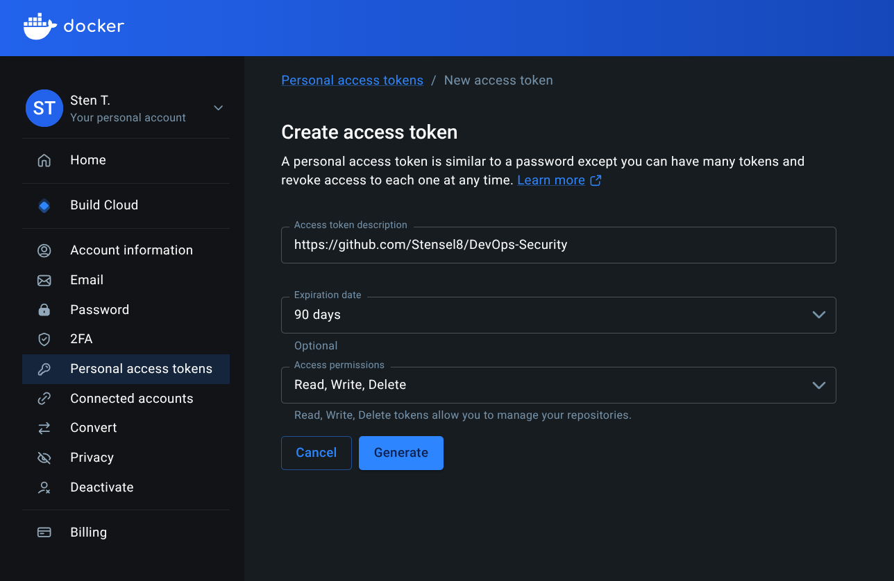


In het AWS Learner Lab heb ik twee instances gemaakt: Ubuntu Server 26.04 LTS, `t2.medium` en 15 GiB opslag, met dezelfde key pair. Ze heten CN1 en CN2.


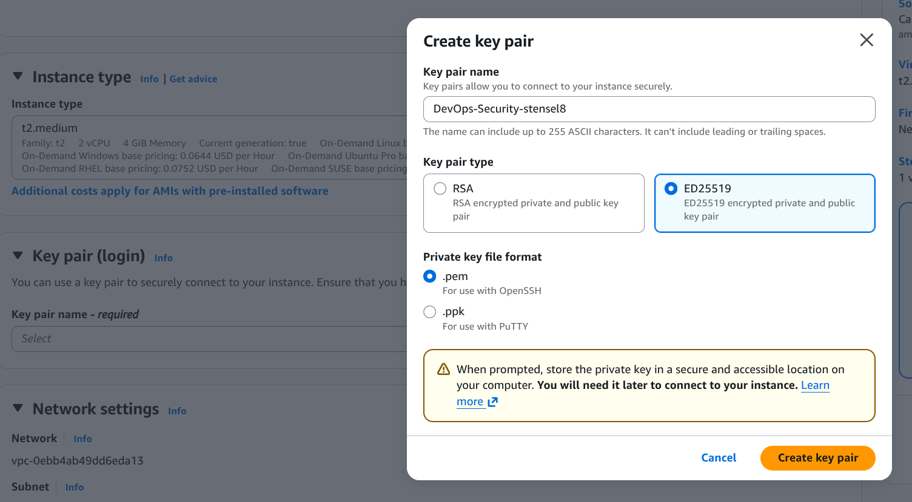
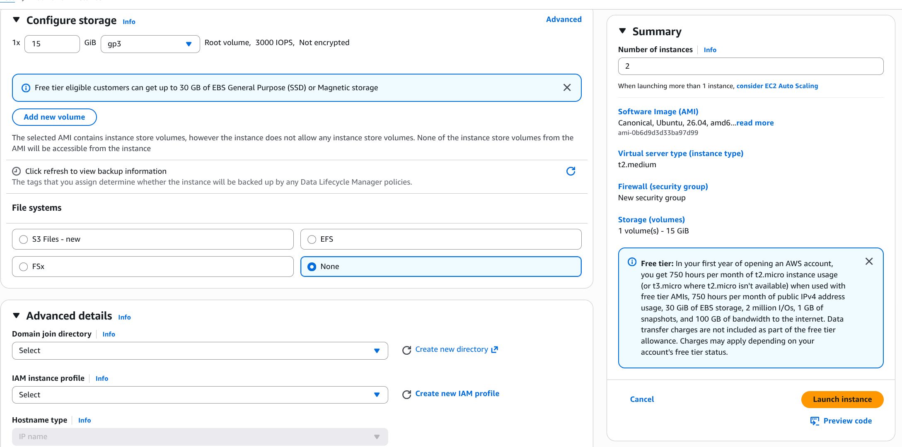

Ik gebruik daarnaast IPv6: beide instances hebben naast hun IPv4-adres ook een IPv6-adres.

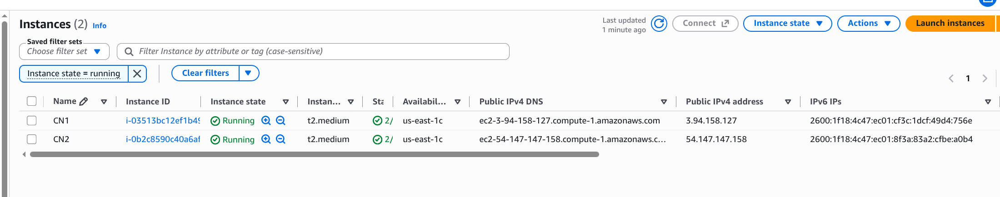

Ik verbind via het DNS-adres, werk de machines bij en zet de hostnames.

```bash
chmod 400 "DevOps-Security-stensel8.pem"
ssh -i "DevOps-Security-stensel8.pem" ubuntu@<public-dns>
sudo apt update && sudo apt upgrade -y
sudo hostnamectl hostname CN1      # CN2 op de andere node
sudo reboot
```

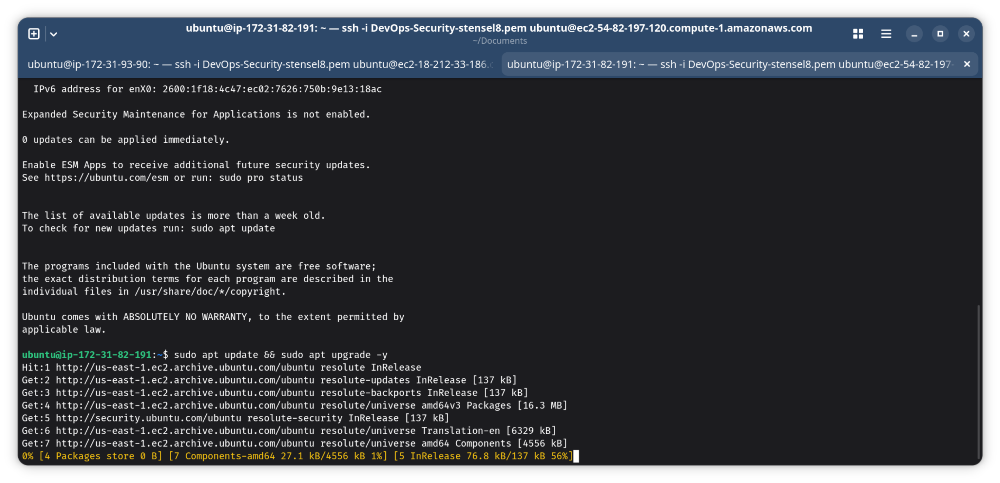
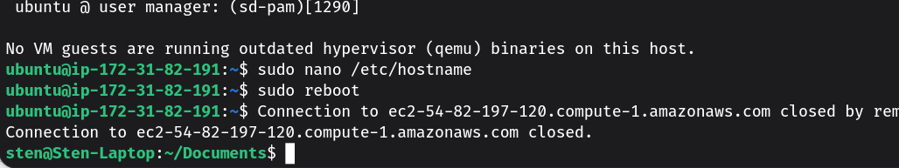

Daarna installeer ik K3s met mijn eigen script [install-k3s.sh](kubernetes/install-k3s.sh), `--control-plane` op CN1 en `--worker` op CN2. Het script draai ik met `sudo`, maar het cluster beheer ik daarna als gewone gebruiker: het script zet de kubeconfig op `0640` voor mijn groep, dus `kubectl` werkt zonder `sudo`. Bij de standaardinstallatie uit de handleiding is de kubeconfig alleen voor root leesbaar en moet je steeds `sudo kubectl` gebruiken.

```bash
sudo ./install-k3s.sh --control-plane                                              # CN1
sudo ./install-k3s.sh --worker --url https://<private-ip-cn1>:6443 --token <token> # CN2
kubectl get nodes                                                                  # CN1
```


Daarna heb ik op CN1 een self-hosted GitHub runner geïnstalleerd (GitHub, Settings, Actions, Runners, New self-hosted runner) en CN1 als runner gejoind. Zie de screenshots.

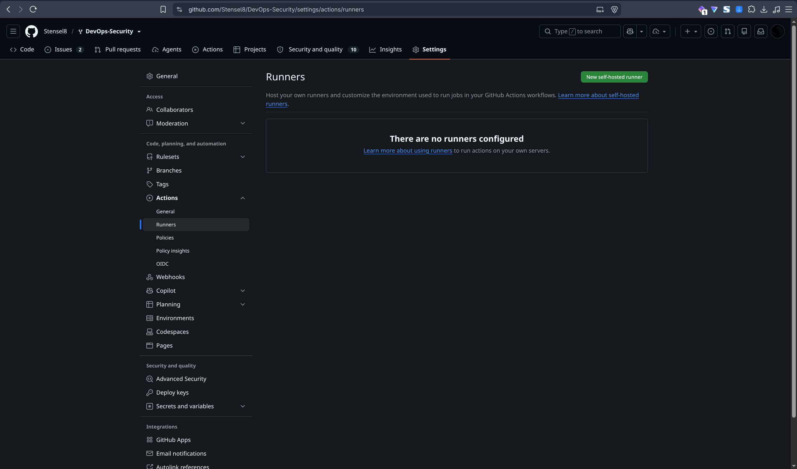


De runner pakte meteen de wachtende Deploy-stap op en voerde die uit. Omdat de Docker Hub-repository op dat moment nog public was, kon het cluster het image zonder inloggen ophalen en slaagde de deploy direct.

Voor het pull-secret van het cluster heb ik een apart Docker Hub-token gemaakt met alleen-lezen rechten, want CN1 heeft geen reden om naar mijn repository te schrijven. Dat token staat als GitHub-secret `DOCKER_HUB_PULL_PAT`, zodat de runner het kan gebruiken: de deploy-stap maakt er bij elke run het pull-secret `regcred` mee aan. Zo staan alle secrets centraal op één plek, en niet in bestanden of in de shell-history op CN1. Vervang ik de runner of voeg ik er een toe, dan hoef ik niets over te zetten.

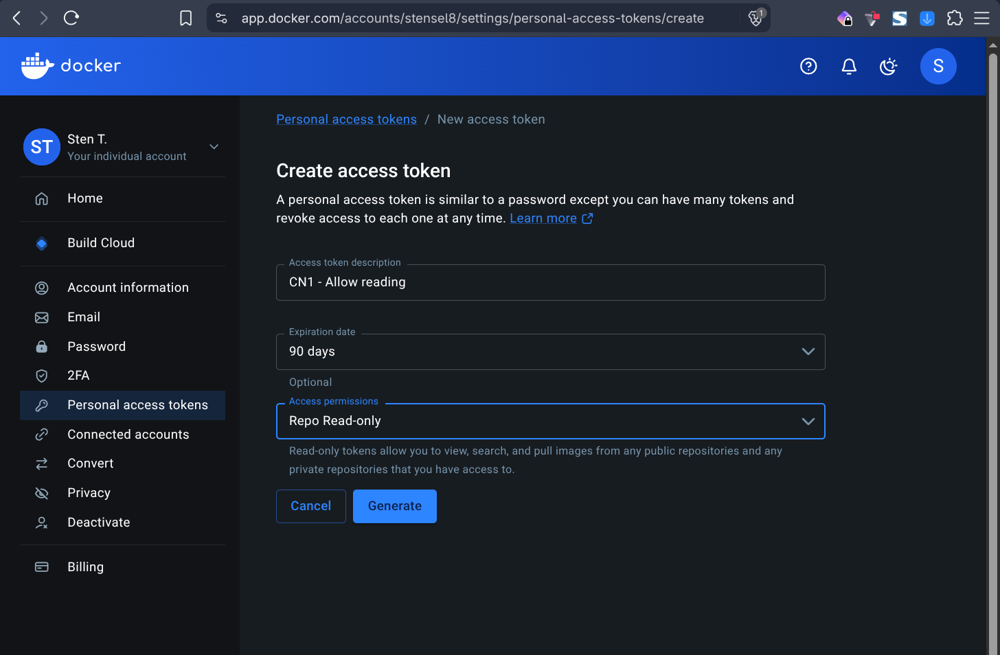
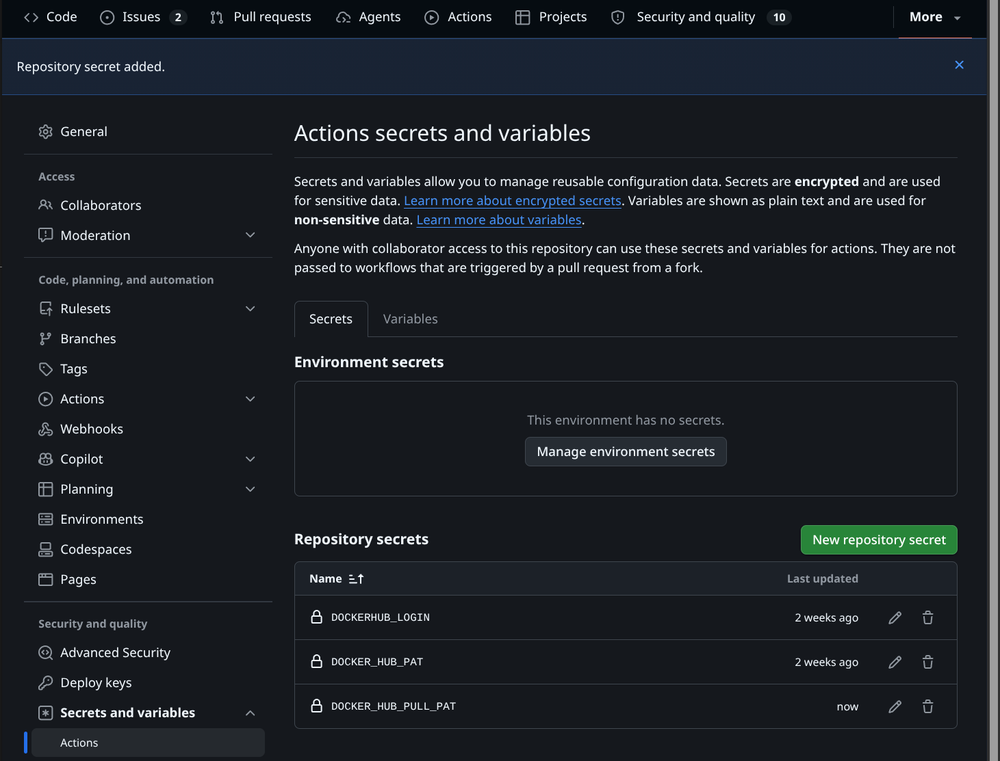

Daarna heb ik de Docker Hub-repository op Private gezet. Het cluster kan het image nog steeds ophalen: als ik de pod verwijder, maakt de Deployment een nieuwe pod die het image met `regcred` pullt en op `Running` komt.

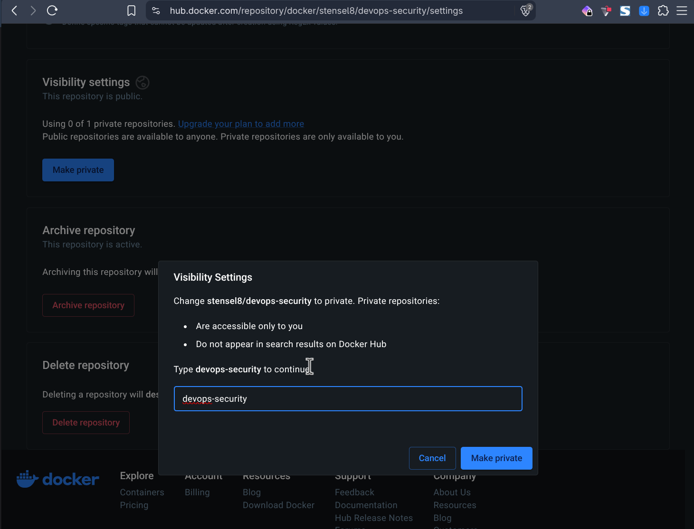

```
$ kubectl get secret regcred
NAME      TYPE                             DATA   AGE
regcred   kubernetes.io/dockerconfigjson   1      5m15s
$ kubectl delete pod -l app=quoterxp
pod "student-devsecops-64fd5b7554-8p6hk" deleted from default namespace
$ kubectl get pods
NAME                                 READY   STATUS    RESTARTS   AGE
student-devsecops-64fd5b7554-dzd64   1/1     Running   0          38s
```

Voor de security group heb ik alleen de poorten open gelaten die K3s nodig heeft, volgens de [K3s-documentatie](https://docs.k3s.io/installation/requirements). Tussen de nodes zijn dat TCP 6443 (de worker meldt zich bij de API van CN1), UDP 8472 (Flannel VXLAN, het pod-netwerk) en TCP 10250 (de kubelet), met de security group zelf als bron. Poorten 2379-2380, 51820/51821 en 5001 zijn niet nodig, want ik gebruik geen HA, geen WireGuard en geen Spegel. Verder staan SSH (22) en de app (NodePort 30000) alleen open voor mijn eigen IPv4- en IPv6-adres. HTTP, HTTPS en de regel voor al het verkeer binnen de groep heb ik verwijderd. Mijn IP-adressen zijn in de screenshot afgedekt.

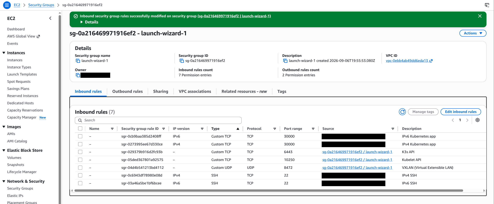

Voor IPv6 heb ik in commit [`b67d2b9`](https://github.com/Stensel8/DevOps-Security/commit/b67d2b92c71dee64aab7515fa307ab8d0a59b20d) drie dingen aangepast: het K3s-script kreeg een `--dual-stack` optie, de Service kreeg `ipFamilyPolicy: PreferDualStack` en de app luistert op `::` in plaats van `0.0.0.0`, dus op IPv4 én IPv6. K3s accepteert dual-stack alleen bij het aanmaken van het cluster, dus heb ik K3s opnieuw geïnstalleerd met `sudo ./install-k3s.sh --control-plane --dual-stack` en daarna de Deploy opnieuw gedraaid. Een push start de pipeline die het image met de nieuwe Dockerfile bouwt.


De app antwoordt nu op poort 30000 via zowel IPv4 als IPv6, op beide nodes:

```bash
curl -4 http://<dns-van-de-node>:30000
curl -6 "http://[<ipv6-van-de-node>]:30000"
```

Om te laten zien dat een codewijziging automatisch wordt uitgerold, heb ik de titel van de app meerdere keren aangepast in `quoter_templates.py` en weer teruggezet ([`de36b32`](https://github.com/Stensel8/DevOps-Security/commit/de36b32), [`ccb61ec`](https://github.com/Stensel8/DevOps-Security/commit/ccb61ec) en [`cb9e32c`](https://github.com/Stensel8/DevOps-Security/commit/cb9e32c)). Na elke commit draaien Validate, Build, Test en Deploy, en de pagina op poort 30000 verandert live. Zie de [screencast](docs/video/live-uitrol.webm) (10 minuten, AV1).

### 1.2 Standaarden: ISO 27001, ISO 27002, NIS2 en CIS

ISO 27001 is een norm voor een informatiebeveiligingsmanagementsysteem (ISMS) met 93 maatregelen, en ISO 27002 is de richtlijn daarbij. NIS2 is een EU-wet met verplichte maatregelen en een meldplicht; in Nederland is dat de Cyberbeveiligingswet. De CIS Controls zijn 18 concrete, geprioriteerde controls voor de technische kant.

ISO en NIS2 zeggen wat je moet afdekken, CIS zegt wat je technisch doet en in welke volgorde. CIS heeft daarvoor officiële mappings naar ISO 27001, ISO 27002 en NIS2.

Mijn advies aan SolidApps is om eerst na te gaan of ze onder NIS2 vallen, ISO 27001 als kader te gebruiken en de CIS Controls en CIS Benchmarks voor Kubernetes, Docker en Ubuntu als technische basis te nemen. Die controles kunnen automatisch in de pipeline draaien, en de koppeling tussen NIS2, ISO en CIS legt SolidApps één keer vast.

Bronnen: [ISO 27001](https://www.iso.org/standard/27001), [ISO 27002](https://www.iso.org/standard/75652.html), [NIS2](https://eur-lex.europa.eu/eli/dir/2022/2555/oj), [CIS Controls](https://www.cisecurity.org/controls/v8), [CIS mapping naar ISO 27001](https://www.cisecurity.org/insights/white-papers/cis-controls-v8-1-mapping-to-iso-iec-27001-2022), [CIS mapping naar NIS2](https://www.cisecurity.org/insights/white-papers/cis-controls-v8-1-mapping-to-nis2-directive-2022-2555).

### 1.3 CVE's en signature-based detectie

CVE's zijn in te delen op ernst (CVSS), type zwakte (CWE, zoals SQL-injectie of XSS), aanvalsvector, getroffen laag (besturingssysteem, taalpakket, container-runtime, Kubernetes) en prioriteit (CISA KEV en EPSS).

Als ik het image in de beginstaat bouw, is hij al erg kwetsbaar. Docker Scout flagt meteen alles: 96 kwetsbaarheden, waarvan 3 Critical en 21 High. Het meeste komt uit de basisimage (`python:3-slim-bookworm`), maar ook in onze eigen lagen zitten 9 High. Zie de screenshots.

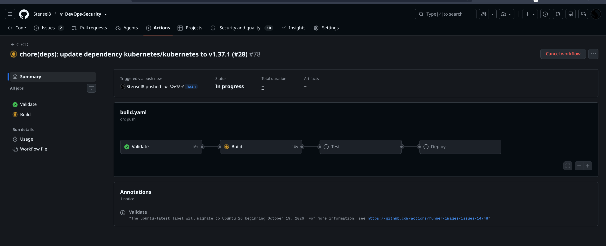


Een Trivy-scan telt anders (98 High/Critical-bevindingen), omdat scanners andere databases en tellingen gebruiken. Daarin zitten 96 bevindingen in de Debian-basislaag zonder fix en 2 in Python-pakketten van Poetry, mét fix.

Bij signature-based detectie vergelijkt een scanner de pakketten en versies in een image (de SBOM) met databases van bekende kwetsbaarheden, zoals de NVD en OSV. SolidApps kan dat bij elke build in de pipeline doen (Docker Scout of Trivy) en images periodiek opnieuw scannen, omdat er dagelijks nieuwe CVE's bijkomen. Het vindt alleen bekende kwetsbaarheden.

Bronnen: [CVE](https://www.cve.org), [NVD en CVSS](https://nvd.nist.gov/vuln-metrics/cvss), [CWE](https://cwe.mitre.org), [CISA KEV](https://www.cisa.gov/known-exploited-vulnerabilities-catalog), [EPSS](https://www.first.org/epss/), [OSV](https://osv.dev), [Trivy](https://trivy.dev), [Docker Scout](https://docs.docker.com/scout/).

### Extra: GitHub Advanced Security met CodeQL

Als extra heb ik GitHub Advanced Security met CodeQL ingericht. Dat staat in de repository onder Settings, Advanced Security. Zie de screenshots voor de instellingen.

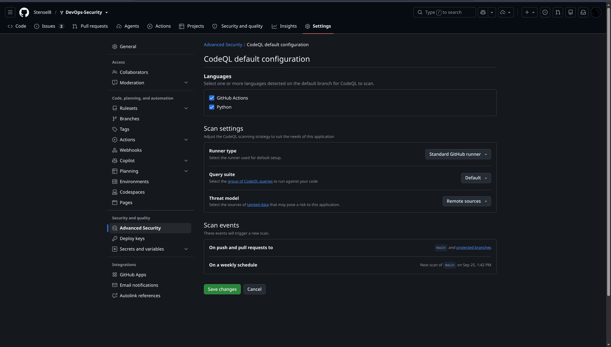
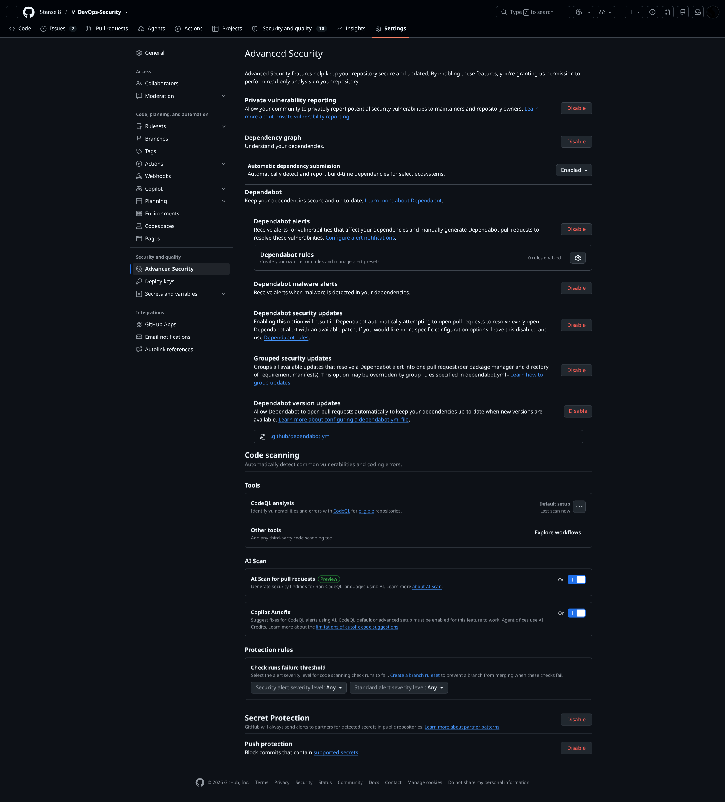

GitHub toont daarna een getal (10) bij het tabblad Security and quality, en onder Code scanning staan de kwetsbaarheden die de ingebouwde tooling al gevonden heeft.


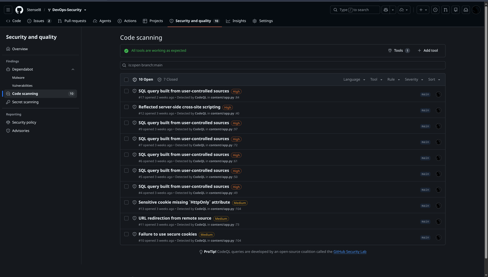

Als ik op een kwetsbaarheid klik, zie ik precies wat er mis is en waar het staat. GitHub geeft ook een link naar de CWE in de MITRE-database, hier [CWE-89](https://cwe.mitre.org/data/definitions/89.html) (SQL-injectie).


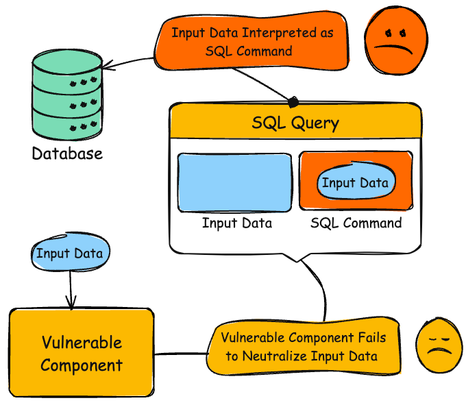
