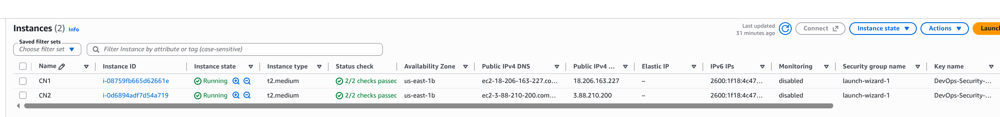

# DevOps Security
Demo application. This is used for Kubernetes / Vulnerability explanation.

Still a a WIP.

View on Docker Hub: https://hub.docker.com/r/stensel8/devops-security

Stap 1: Installeer 2 AWS EC2 instances (Ubuntu 26.04 LTS) en noem deze CN1 en CN2.

Stap 2: Installeer Docker op beide instances. 

Stap 3: Installeer K3s op beide instances. Hiervoor heb ik het script kubernetes/install-k3s.sh gebruikt.

Stap 4: 
