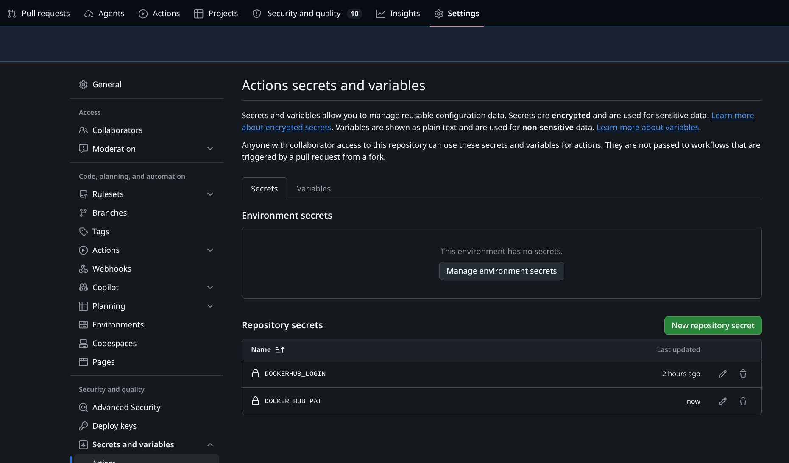
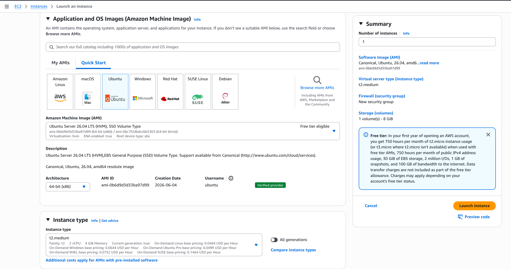
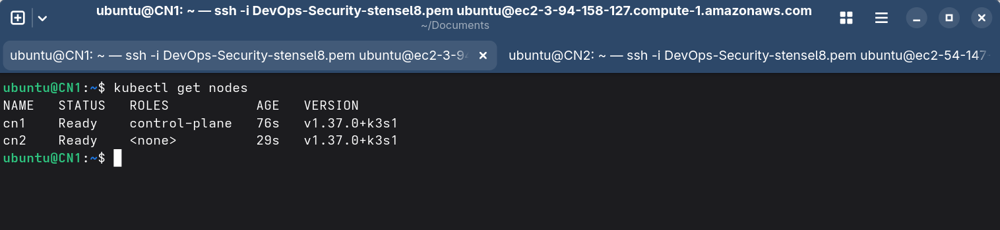
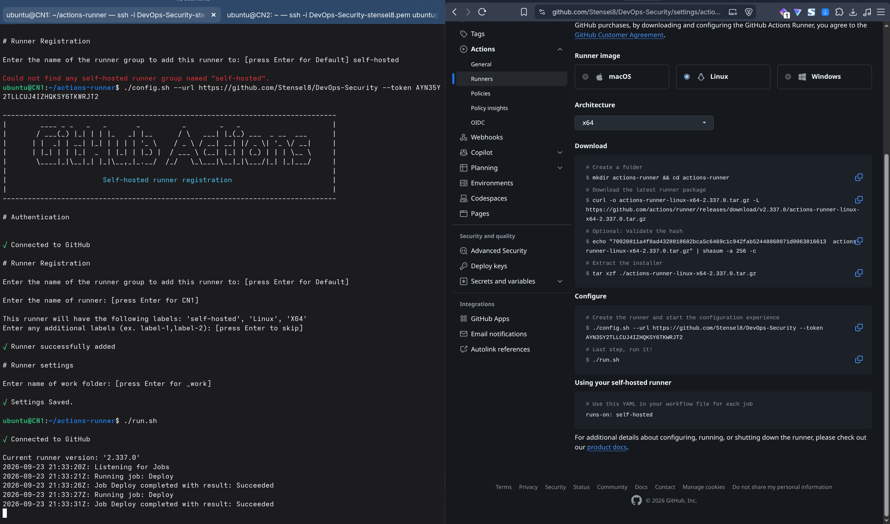
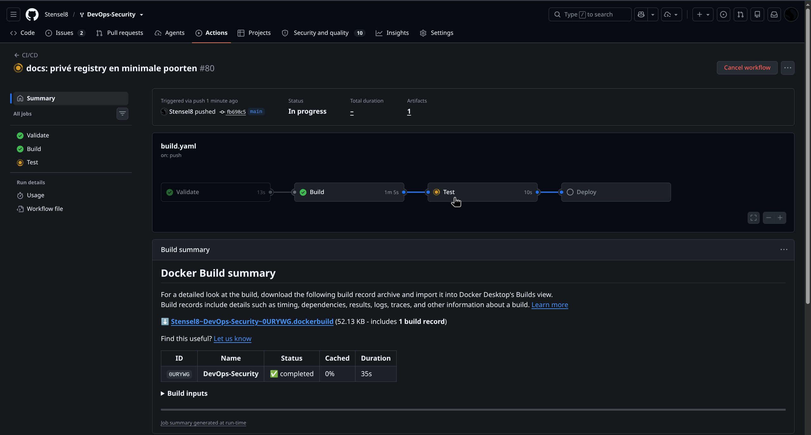

# Week 1

Ik zet de testomgeving neer: twee VM's met Kubernetes, een pipeline in GitHub Actions en Docker Hub voor de images. Een wijziging in de code moet vanzelf op het cluster komen. Daarnaast schrijf ik twee adviezen voor SolidApps: standaarden (1.2) en CVE's (1.3).

## 1.1 Bootomgeving

Ik heb op Docker Hub een repository en een access token gemaakt. Die staan als secrets in GitHub, zodat de pipeline er images naartoe kan pushen. De repository staat op Private. Voor de docent zet ik hem soms tijdelijk op Public.




In het AWS Learner Lab heb ik twee VM's gemaakt met Ubuntu Server 26.04 LTS, type `t2.medium` en 15 GiB opslag (de standaard 8 GiB is te weinig). Ze gebruiken dezelfde key pair en heten CN1 en CN2.




IPv6 staat standaard uit. Dat heb ik extra aangezet, dus beide VM's hebben een IPv4- en een IPv6-adres.


Ik verbind met SSH via het DNS-adres, update de machine en zet de hostname gelijk aan de naam in AWS.

```bash
chmod 400 "DevOps-Security-stensel8.pem"
ssh -i "DevOps-Security-stensel8.pem" ubuntu@<public-dns>
sudo apt update && sudo apt upgrade -y
sudo hostnamectl hostname CN1      # CN2 op de andere node
sudo reboot
```


K3s installeer ik met mijn eigen script [install-k3s.sh](../kubernetes/install-k3s.sh): `--control-plane` op CN1 en `--worker` op CN2. Het script zet de kubeconfig op `0640` voor mijn groep, dus `kubectl` werkt zonder `sudo`.

```bash
sudo ./install-k3s.sh --control-plane                                              # CN1
sudo ./install-k3s.sh --worker --url https://<private-ip-cn1>:6443 --token <token> # CN2
kubectl get nodes                                                                  # CN1
```



Op CN1 heb ik een self-hosted GitHub runner geïnstalleerd (Settings, Actions, Runners, New self-hosted runner). Hij pakte meteen de wachtende Deploy-stap op. De repository was toen nog Public, dus het cluster kon het image zonder inloggen ophalen.




Voor het pull-secret heb ik een tweede Docker Hub-token gemaakt met alleen lees-rechten. Het staat als secret `DOCKER_HUB_PULL_PAT` in GitHub en de deploy-stap maakt er bij elke run `regcred` mee aan. Zo staat er geen wachtwoord in mijn bash history.


Daarna heb ik de repository op Private gezet. Ik verwijder de pod om te kijken of het cluster het image nog kan pullen:


```
$ kubectl get secret regcred
NAME      TYPE                             DATA   AGE
regcred   kubernetes.io/dockerconfigjson   1      5m15s
$ kubectl delete pod -l app=quoterxp
pod "student-devsecops-64fd5b7554-8p6hk" deleted from default namespace
$ kubectl get pods
NAME                                 READY   STATUS    RESTARTS   AGE
student-devsecops-64fd5b7554-dzd64   1/1     Running   0          38s
```

In de security group staan alleen de poorten open die K3s nodig heeft ([K3s-documentatie](https://docs.k3s.io/installation/requirements)), met de security group zelf als bron: TCP 6443 (worker naar CN1), UDP 8472 (Flannel VXLAN) en TCP 10250 (kubelet). SSH (22) en de app (NodePort 30000) staan alleen open voor mijn eigen IPv4- en IPv6-adres. HTTP, HTTPS en de regel voor al het verkeer binnen de groep heb ik verwijderd. Mijn IP-adressen zijn in de screenshot zwart gemaakt.


Om te laten zien dat een wijziging vanzelf op het cluster komt, heb ik een paar keer de titel van de app aangepast en teruggezet ([`de36b32`](https://github.com/Stensel8/DevOps-Security/commit/de36b32), [`ccb61ec`](https://github.com/Stensel8/DevOps-Security/commit/ccb61ec), [`cb9e32c`](https://github.com/Stensel8/DevOps-Security/commit/cb9e32c)). Na elke commit lopen Validate, Build, Test en Deploy en verandert de pagina op poort 30000. Zie de [screencast](video/live-uitrol.webm) (10 minuten).

### De pipeline

De pipeline in [build.yaml](../.github/workflows/build.yaml) heeft vier jobs. Validate kijkt of `pyproject.toml` en `poetry.lock` kloppen en of de code compileert. Build bouwt het runtime-image (zie week 3) en pusht `latest` en de commit-SHA naar Docker Hub. Test start het image van die commit en wacht tot de app antwoordt. Deploy draait op de runner op CN1. Die maakt `regcred` aan, past de Deployment (met de tag van die commit) en de Service toe en wacht tot de uitrol klaar is. Lukt dat niet, dan draait Deploy terug en wordt de pipeline rood.

Op een pull request lopen alleen Validate en Build, zonder push en deploy. Handmatig starten kan alleen op `main`.

De Deployment gebruikt een rolling update met een readiness probe, zodat de oude pod blijft draaien tot de nieuwe gezond is (commit [`f3b7bdd`](https://github.com/Stensel8/DevOps-Security/commit/f3b7bdd)).



### Onder welk account draait de runner?

De runner draait als `ubuntu` (zie `ubuntu@CN1` in de [screenshot](images/runner-config.png)). Dat account kan `sudo` zonder wachtwoord en gebruikt de kubeconfig van de K3s-admin. Deploy draait dus met alle rechten op het cluster. Voor productie is dat niet veilig: wie de workflow kan aanpassen, kan alles op CN1 en in het cluster.

Beter is een eigen gebruiker zonder `sudo`, met een kubeconfig die alleen deployments en services in één namespace mag beheren, en een runner die niet op de control plane staat. Nu draait Deploy alleen op `main`, niet bij pull requests.

De runner maakt zelf een uitgaande HTTPS-verbinding met GitHub, dus er hoeft geen poort open naar internet. `kubectl` praat lokaal met de API van K3s. Het pull-secret komt uit GitHub en heeft alleen lees-rechten.

## 1.2 Standaarden: ISO 27001, ISO 27002, NIS2 en CIS

ISO 27001 is een norm voor informatiebeveiliging in een organisatie (een ISMS), met 93 maatregelen. ISO 27002 legt uit hoe die maatregelen ingevuld worden. NIS2 is een Europese wet die bepaalde organisaties verplicht om maatregelen te nemen en incidenten te melden. In Nederland heet die de Cyberbeveiligingswet. De CIS Controls zijn 18 controls met technische maatregelen, op volgorde van prioriteit.

ISO 27001 en NIS2 zeggen vooral wat geregeld moet zijn. CIS zegt wat technisch kan en waar te beginnen. CIS heeft ook tabellen die de controls koppelen aan ISO 27001, ISO 27002 en NIS2.

Mijn advies voor SolidApps:

1. Uitzoeken of ze onder NIS2 vallen.
2. ISO 27001 als kader.
3. De CIS Controls en CIS Benchmarks voor Kubernetes, Docker en Ubuntu als technische basis. Die controles kunnen automatisch in de pipeline draaien.
4. Eén keer vastleggen welke NIS2-maatregel bij welke ISO- en CIS-maatregel hoort.

Bronnen: [ISO 27001](https://www.iso.org/standard/27001), [ISO 27002](https://www.iso.org/standard/75652.html), [NIS2](https://eur-lex.europa.eu/eli/dir/2022/2555/oj), [CIS Controls](https://www.cisecurity.org/controls/v8), [CIS mapping naar ISO 27001](https://www.cisecurity.org/insights/white-papers/cis-controls-v8-1-mapping-to-iso-iec-27001-2022), [CIS mapping naar NIS2](https://www.cisecurity.org/insights/white-papers/cis-controls-v8-1-mapping-to-nis2-directive-2022-2555).

## 1.3 CVE's en signature-based detectie

CVE's kunnen op een paar manieren ingedeeld worden: op ernst (CVSS: Low, Medium, High, Critical), op type zwakte (CWE, zoals SQL-injectie of XSS), op aanvalsvector (via het netwerk of lokaal) en op waar de fout zit (besturingssysteem, package, container runtime of Kubernetes). Ook kan ik kijken hoe snel het moet: staat een CVE op de CISA KEV-lijst, dan wordt hij al misbruikt, en de EPSS-score zegt hoe groot de kans op misbruik is.

Bij signature-based detectie vergelijkt een scanner de packages en versies in een image (de SBOM) met databases met bekende kwetsbaarheden, zoals de NVD en OSV. SolidApps kan dat bij elke build in de pipeline doen, bijvoorbeeld met Docker Scout of Trivy. Er komen elke dag nieuwe CVE's bij, dus bestaande images moeten ook regelmatig opnieuw gescand worden. Het nadeel is dat alleen bekende kwetsbaarheden gevonden worden, dus geen zero-days.

Bronnen: [CVE](https://www.cve.org), [NVD en CVSS](https://nvd.nist.gov/vuln-metrics/cvss), [CWE](https://cwe.mitre.org), [CISA KEV](https://www.cisa.gov/known-exploited-vulnerabilities-catalog), [EPSS](https://www.first.org/epss/), [OSV](https://osv.dev), [Trivy](https://trivy.dev), [Docker Scout](https://docs.docker.com/scout/).
