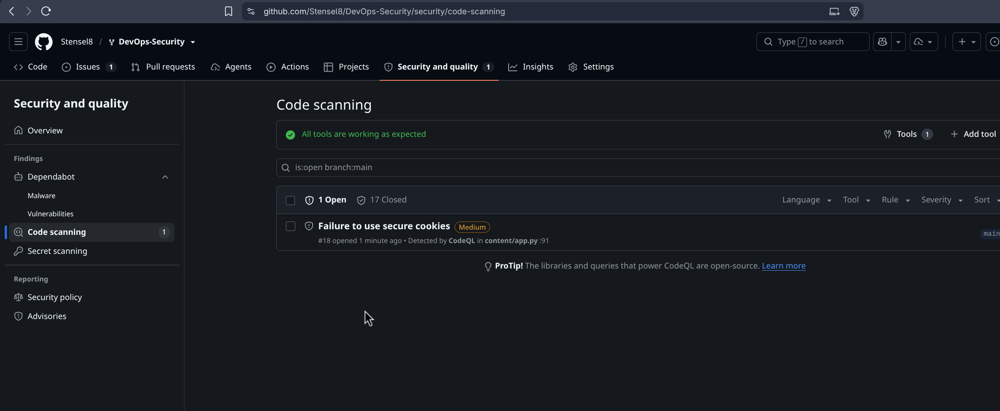
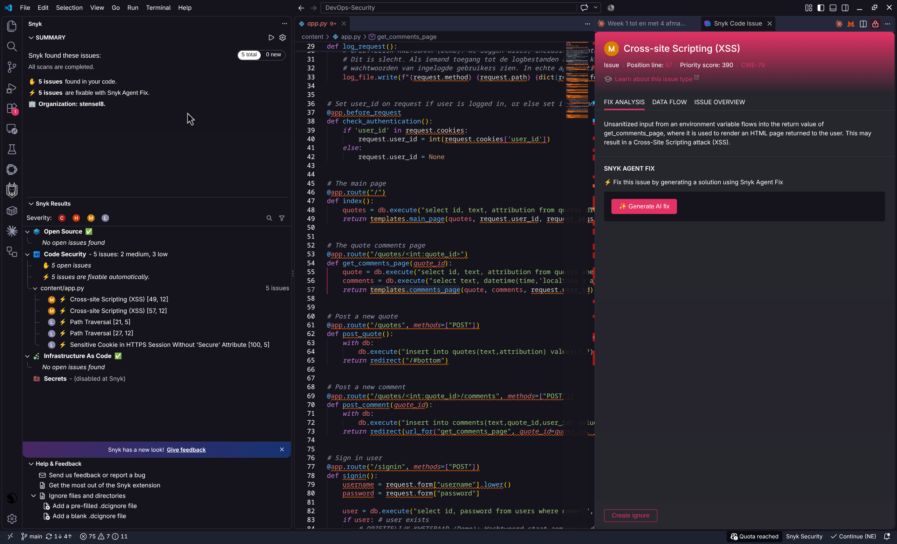

# Week 2

Ik installeer Snyk, scan de repository van week 1 en fix minstens twee kwetsbaarheden. Daarnaast schrijf ik een advies voor de developers van SolidApps (2.3).

## 2.1 Snyk installeren en de repository scannen

Ik heb Snyk gekoppeld aan mijn GitHub-account: inloggen met GitHub, toestemming geven en de registratie afronden. De dataregio laat ik op SNYK-US-01. De EU-regio werkte niet voor de GitHub-koppeling, want GitHub zit op US.


Daarna heb ik GitHub als integratie gekozen, de repository `DevOps-Security` geïmporteerd en Snyk Code aangezet. Dat staat standaard uit. Het project moet daarna opnieuw geïmporteerd worden.


Snyk vindt:

| Scanner | Bestand | Gevonden |
| --- | --- | --- |
| Snyk Code | `content/app.py` | 4× SQL-injectie ([CWE-89](https://cwe.mitre.org/data/definitions/89.html)) en 1× XSS ([CWE-79](https://cwe.mitre.org/data/definitions/79.html)), allemaal High. 2× Low voor de cookie zonder `HttpOnly` en zonder `Secure`. |
| Snyk IaC | `kubernetes/deployment.yaml` | 8 punten (3 Medium, 5 Low), o.a. geen root-user control en geen memory limit. |
| Snyk Open Source | | Niets. |


Ik heb ook de Snyk-extensie in VS Code geïnstalleerd. Die toont dezelfde kwetsbaarheden, met regelnummer en uitleg.


## Extra: GitHub Advanced Security met CodeQL

Als extra heb ik GitHub Advanced Security met CodeQL ingericht (Settings, Advanced Security). Onder Code scanning staan de meldingen, met per melding wat er mis is, waar, en een link naar de CWE bij MITRE. Secret scanning met push protection staat ook aan.


## 2.2 Kwetsbaarheden fixen

Voor de fixes stonden er 10 open meldingen in Code scanning (CodeQL): 6× SQL-injectie, 1× XSS, 1× URL-redirect en 2× cookie.


Fix 1 t/m 5 gaan over deze meldingen. Fix 6 pakt de punten van Snyk IaC aan. Daarna staan nog een paar extra fixes.

De diffs zijn ingekort tot de veranderde code, met bestand en regelnummer. De hele diff staat in de commit. De map `app/` heette toen nog `content/`. Voor het bewijs heb ik de app lokaal gedraaid in Docker. Bij "voor" is dat de commit vóór de fix. Bij "na" is dat het huidige image van `main`, met `--read-only --user 10001:10001 --cap-drop ALL`.

### Fix 1: SQL-injectie

De app plakte invoer met een f-string in de SQL-query. Ik heb overal parameters (`?`) van gemaakt. Snyk vond 4 plekken en CodeQL 6, ik heb alle 6 aangepast.


Commit [`4965429`](https://github.com/Stensel8/DevOps-Security/commit/4965429):

```diff
@@ content/app.py:46-47 @@
-    quote = db.execute(f"select id, text, attribution from quotes where id={quote_id}").fetchone()
-    comments = db.execute(f"select text, datetime(time,'localtime') as time, name as user_name from comments c left join users u on u.id=c.user_id where quote_id={quote_id} order by c.id").fetchall()
+    quote = db.execute("select id, text, attribution from quotes where id=?", (quote_id,)).fetchone()
+    comments = db.execute("select text, datetime(time,'localtime') as time, name as user_name from comments c left join users u on u.id=c.user_id where quote_id=? order by c.id", (quote_id,)).fetchall()
@@ content/app.py:55 @@
-        db.execute(f"""insert into quotes(text,attribution) values("{request.form['text']}","{request.form['attribution']}")""")
+        db.execute("insert into quotes(text,attribution) values(?,?)", (request.form['text'], request.form['attribution']))
@@ content/app.py:64 @@
-        db.execute(f"""insert into comments(text,quote_id,user_id) values("{request.form['text']}",{quote_id},{request.user_id})""")
+        db.execute("insert into comments(text,quote_id,user_id) values(?,?,?)", (request.form['text'], quote_id, request.user_id))
@@ content/app.py:74 @@
-    user = db.execute(f"select id, password from users where name='{username}'").fetchone()
+    user = db.execute("select id, password from users where name=?", (username,)).fetchone()
@@ content/app.py:85 @@
-            cursor = db.execute(f"insert into users(name,password) values('{username}', '{password}')")
+            cursor = db.execute("insert into users(name,password) values(?,?)", (username, password))
```

Voor: inloggen als gebruiker 1 met een wachtwoord dat ik zelf via de UNION meegeef.

```
$ curl -si --data-urlencode "username=nope' UNION SELECT 1,'hax" --data-urlencode "password=hax" localhost:5000/signin | grep -E '^(HTTP|Location|Set-Cookie)'
HTTP/1.1 302 FOUND
Location: /
Set-Cookie: user_id=1; Path=/
```

Na: dezelfde invoer maakt een nieuw account aan. De sessie is van gebruiker 3, niet van gebruiker 1.

```
$ curl -si --data-urlencode "username=nope' UNION SELECT 1,'hax" --data-urlencode "password=hax" localhost:5000/signin | grep -E '^(HTTP|Location|Set-Cookie)'
HTTP/1.1 302 FOUND
Location: /
Set-Cookie: session=eyJ1c2VyX2lkIjozfQ.arVG1A.kORSBkJOD1qfDxG9LYba_AejrVo; HttpOnly; Path=/; SameSite=Lax
# eyJ1c2VyX2lkIjozfQ decodeert naar {"user_id":3}
```

### Fix 2: XSS

De app zette invoer zonder escaping in de HTML. Snyk vindt alleen de variant met de `error`-parameter en stelt voor om alleen die te escapen (zie screenshot). Ik escape op één plek in de template met `markupsafe.escape`, dat zat al in de dependencies. Zo zijn ook quotes, commentaren, gebruikersnamen en de paginatitel veilig.


Commit [`251f107`](https://github.com/Stensel8/DevOps-Security/commit/251f107):

```diff
@@ content/quoter_templates.py:1 @@
+from markupsafe import escape
@@ content/quoter_templates.py:7-8 @@
-  <q>{text}</q>
-  <address>{attribution}</address>
+  <q>{escape(text)}</q>
+  <address>{escape(attribution)}</address>
@@ content/quoter_templates.py:19 @@
-    <address>{user_name}</address>
+    <address>{escape(user_name)}</address>
@@ content/quoter_templates.py:22 @@
-  <p>{text}</p>
+  <p>{escape(text)}</p>
@@ content/quoter_templates.py:72 @@
-  <title>{title or "Quoter XP"}</title>
+  <title>{escape(title or "Quoter XP")}</title>
@@ content/quoter_templates.py:103 @@
-    {f"<div class=error>{error}</div>" if error else ""}
+    {f"<div class=error>{escape(error)}</div>" if error else ""}
```

Invoer: ``, via `?error=` en via een quote.

```
# voor
    <div class=error></div>
  <q></q>

# na
    <div class=error>&lt;img src=x onerror=alert(1)&gt;</div>
  <q>&lt;img src=x onerror=alert(1)&gt;</q>
```

### Fix 3: dependencies en SHA-pinning

Ik heb alle dependencies geüpgraded, met Renovate en Dependabot. Snyk Open Source vindt daarom niets.

Verder pin ik alles op een versie of commit SHA. Een tag zoals `v4` kan later naar andere code wijzen, een SHA niet. Renovate en Dependabot maken een pull request voor elke nieuwe versie, dus ik bepaal zelf wanneer ik update. Poetry staat vast op `poetry==2.5.1` (Dockerfile en workflow) en de K3s-versie staat vast in het script. In de Deployment staat `:latest` als plaatsvervanger. Bij het deployen vervangt de pipeline dat door de commit-SHA.

```
$ grep -h 'uses:' .github/workflows/build.yaml | sort -u
        uses: actions/checkout@3d3c42e5aac5ba805825da76410c181273ba90b1 # v7
        uses: actions/setup-python@5fda3b95a4ea91299a34e894583c3862153e4b97 # v7.0.0
        uses: docker/build-push-action@c3c9e263c25d99ce0380d002d59b67737d91b0dc # v7
        uses: docker/login-action@dbcb813823bdd20940b903addbd779551569679f # v4
        uses: docker/setup-buildx-action@f87e5991a6d7451dcb8d9637bfbc97413f497069 # v4

$ grep -n '^FROM' Dockerfile | cut -c1-60
10:FROM python:3.14-alpine@sha256:9e9fde4d32eedce0b661d9ab91
25:FROM python:3.14-alpine@sha256:9e9fde4d32eedce0b661d9ab91
```


### Fix 4: cookie met HttpOnly en SameSite

De `user_id`-cookie had geen `HttpOnly`, dus JavaScript op de pagina kon hem lezen. Met `httponly=True` en `samesite='Lax'` kan dat niet meer. Later heb ik de losse cookie vervangen door een sessie (zie Extra fixes).

Commit [`3dfae64`](https://github.com/Stensel8/DevOps-Security/commit/3dfae64):

```diff
@@ content/app.py:91 @@
-    response.set_cookie('user_id', str(user_id))
+    response.set_cookie('user_id', str(user_id), httponly=True, samesite='Lax')
```

### Fix 5: redirect met url_for

CodeQL meldt een URL-redirect, omdat `quote_id` uit de URL in de redirect terechtkomt. Ik bouw de URL nu met `url_for`.

Commit [`2a2e85f`](https://github.com/Stensel8/DevOps-Security/commit/2a2e85f):

```diff
@@ content/app.py:1 @@
-from flask import Flask, request, redirect, make_response
+from flask import Flask, request, redirect, make_response, url_for
@@ content/app.py:64 @@
-    return redirect(f"/quotes/{quote_id}#bottom")
+    return redirect(url_for("get_comments_page", quote_id=quote_id, _anchor="bottom"))
```

Na de push heeft CodeQL opnieuw gescand en zijn 9 van de 10 meldingen gesloten. De laatste is de `Secure`-vlag op de cookie (zie "Wat nog open staat").



### Fix 6: Snyk IaC in de Deployment

Snyk IaC vond 8 punten in `kubernetes/deployment.yaml`. Ik heb de container beperkt: geen privilege escalation, niet als root (UID 10001, boven de 10000 zodat de UID niet botst met een gebruiker op de host), alle capabilities gedropt, een read-only bestandssysteem, een CPU- en geheugenlimiet en een liveness probe. Extra, niet van Snyk: een seccomp-profiel (`RuntimeDefault`).

Een read-only bestandssysteem past niet bij een app die de SQLite-database en het logbestand naast de code schrijft. Die staan nu in `/data`, een `emptyDir` (commits [`b3d10f5`](https://github.com/Stensel8/DevOps-Security/commit/b3d10f5), [`fd73ded`](https://github.com/Stensel8/DevOps-Security/commit/fd73ded) en [`19d558f`](https://github.com/Stensel8/DevOps-Security/commit/19d558f)). De Deployment zoals hij nu is:

```yaml
      securityContext:
        seccompProfile:
          type: RuntimeDefault
      containers:
      - name: quoterxp
        ...
        securityContext:
          runAsNonRoot: true
          runAsUser: 10001
          runAsGroup: 10001
          allowPrivilegeEscalation: false
          readOnlyRootFilesystem: true
          capabilities:
            drop: ["ALL"]
        resources:
          requests:
            cpu: 50m
            memory: 64Mi
          limits:
            cpu: 500m
            memory: 256Mi
        livenessProbe:
          httpGet:
            path: /
            port: 5000
          initialDelaySeconds: 5
          periodSeconds: 10
        volumeMounts:
          - name: data
            mountPath: /data
      volumes:
        - name: data
          emptyDir: {}
```

Bewijs: deze `deployment.yaml` op K3s v1.37.0 in Docker (dezelfde versie als mijn cluster). Alleen het image en `imagePullPolicy` heb ik aangepast, omdat ik het image lokaal in K3s laad.

```
$ kubectl get pods,svc
NAME                                  READY   STATUS    RESTARTS   AGE
pod/devops-security-89f7bbb7b-fg572   1/1     Running   0          9s

NAME                      TYPE        CLUSTER-IP   EXTERNAL-IP   PORT(S)          AGE
service/devops-security   NodePort    10.43.68.1   <none>        5000:30000/TCP   9s

$ kubectl exec deploy/devops-security -- id
uid=10001 gid=10001 groups=10001
$ kubectl exec deploy/devops-security -- touch /app/x
touch: /app/x: Read-only file system
$ kubectl exec deploy/devops-security -- touch /data/x
```

Trivy op de manifests (`trivy config kubernetes/`) vond 19 punten vóór de fix en 3 erna (`:latest`, default namespace en vertrouwde registry).

```
# voor (b3d10f5^)
Tests: 99 (SUCCESSES: 80, FAILURES: 19)
# na
Tests: 99 (SUCCESSES: 96, FAILURES: 3)
```

Toen ik de Snyk-extensie opnieuw draaide, vond die nog 5 punten. Vier kwamen door mijn eigen wijziging: Snyk ziet de omgevingsvariabele `DATA_DIR` als onbetrouwbare invoer die in een pad terechtkomt. Ik heb de omgevingsvariabele weggehaald, de app gebruikt nu `/data` als die map bestaat. Het vijfde punt is de `Secure`-vlag op de cookie.



### Extra fixes

Bij het testen vond ik nog vier dingen die geen scanner meldde. Ze staan in de code en de commits:

- Het logbestand bevatte de formuliervelden, dus ook wachtwoorden. Nu staan er alleen methode en pad in ([`9355c96`](https://github.com/Stensel8/DevOps-Security/commit/9355c96)).
- Met `app.static_folder = '.'` kon iedereen de database en `app.py` downloaden via `/static/`. Nu is alleen `static/` publiek ([`e217cf4`](https://github.com/Stensel8/DevOps-Security/commit/e217cf4)).
- Wachtwoorden stonden in platte tekst in de database. Nu staan ze als scrypt-hash ([`6a929c6`](https://github.com/Stensel8/DevOps-Security/commit/6a929c6)).
- De cookie `user_id=1` kon ik zelf aanpassen om als een andere gebruiker in te loggen. Nu gebruik ik de ondertekende sessie van Flask, met `HttpOnly` en `SameSite=Lax` ([`f2aef79`](https://github.com/Stensel8/DevOps-Security/commit/f2aef79)).

### Wat nog open staat

De `Secure`-vlag op de cookie heb ik niet gezet. Die werkt alleen met HTTPS en de app draait op gewone HTTP. Een browser slaat een `Secure`-cookie niet op via HTTP, dus dan kan ik niet meer inloggen. In GitHub heb ik de melding gesloten als "won't fix", met deze reden erbij. Zodra er HTTPS is, bijvoorbeeld met de Ingress met certificaat uit week 5, zet ik `SESSION_COOKIE_SECURE` aan. De app heeft ook nog geen CSRF-bescherming en geen limiet op het aantal inlogpogingen.

## 2.3 Advies: veilig ontwikkelen in Plan en Code

SolidApps werkt met JavaScript en C# in Visual Studio. Mijn advies voor de fasen Plan en Code:

Ik zou beginnen met threat modeling. Bij elke nieuwe functie bekijken ze met STRIDE wat er mis kan gaan, op een data flow diagram. Met DREAD of de OWASP-risicomethode bepalen ze wat ze het eerst aanpakken. Bij onze app blijkt zo dat inloggen en quote plaatsen invoer van buiten krijgen (tampering, SQL-injectie) en dat er gebruikersgegevens worden opgeslagen (information disclosure).

Als standaard voor de code kunnen ze de OWASP Top 10 gebruiken, met OWASP ASVS als checklist en de OWASP cheat sheets per kwetsbaarheid. Voor SQL-injectie zijn dat parameters in queries en voor XSS output encoding, dus mijn twee fixes. Afspraken: nooit strings in een query plakken, uitvoer altijd escapen en geen secrets in de code.

Voor tooling is de Snyk-extensie in de IDE handig (die bestaat ook voor Visual Studio), want die laat fouten zien tijdens het typen. Secret scanning met push protection staat in mijn repository aan. Code gaat via een pull request met review, en Snyk en CodeQL draaien als check op elke pull request, zodat een kwetsbaarheid niet ongemerkt in `main` komt. Dependabot en Renovate houden de dependencies bij.

SAST (static application security testing) kijkt naar de broncode zonder dat de app draait en vindt bijvoorbeeld een f-string in `db.execute`. Het kan vroeg (in de IDE en bij pull requests), maar geeft ook meldingen die niet kloppen (false positives). Snyk Code en CodeQL zijn SAST. DAST (dynamic application security testing) test de draaiende applicatie van buitenaf, bijvoorbeeld met OWASP ZAP. Dat vindt problemen in de configuratie en tijdens het draaien, maar kan pas laat en zegt niet op welke regel de fout zit. Ik zou SAST gebruiken tijdens Plan en Code en DAST in de testfase van de pipeline, tegen de omgeving die net is uitgerold.

Bronnen: [DevSecOps-controls (Microsoft)](https://learn.microsoft.com/nl-nl/azure/cloud-adoption-framework/secure/devsecops-controls), [SAST (Snyk)](https://snyk.io/learn/application-security/static-application-security-testing/), [Threat modeling (OWASP)](https://owasp.org/www-community/Threat_Modeling), [Bedreigingen per STRIDE-categorie (Microsoft)](https://learn.microsoft.com/en-us/azure/security/develop/threat-modeling-tool-threats), [OWASP Top 10](https://owasp.org/www-project-top-ten/), [OWASP ASVS](https://owasp.org/www-project-asvs/), [SQL Injection Prevention Cheat Sheet](https://cheatsheetseries.owasp.org/cheatsheets/SQL_Injection_Prevention_Cheat_Sheet.html), [XSS Prevention Cheat Sheet](https://cheatsheetseries.owasp.org/cheatsheets/Cross_Site_Scripting_Prevention_Cheat_Sheet.html), [Source Code Analysis Tools (OWASP)](https://owasp.org/www-community/Source_Code_Analysis_Tools), [OWASP ZAP](https://www.zaproxy.org/), [Voorbeeld SQL-injectie](https://github.com/doublehops/sql-injection-attack-example).

Voor SHA-pinning: [Security hardening for GitHub Actions](https://docs.github.com/en/actions/how-tos/security-for-github-actions/security-guides/security-hardening-for-github-actions), [Docker best practices: pin base image versions](https://docs.docker.com/build/building/best-practices/) en [Renovate: Docker digest pinning](https://docs.renovatebot.com/docker/).
