# Week 2

Voor week 2 is het de bedoeling dat ik Snyk installeer, de repository van vorige week scan en minstens twee kwetsbaarheden oplos door de code aan te passen. Daarnaast schrijf ik een advies over veilig ontwikkelen.

## 2.1 Snyk installeren en de repository scannen

Ik heb Snyk gekoppeld aan mijn GitHub-account: ik log in met GitHub, geef toestemming en rond de registratie af. De dataregio laat ik op de standaard staan, SNYK-US-01. De EU-regio werkte niet voor de GitHub-koppeling, want GitHub zit op US.

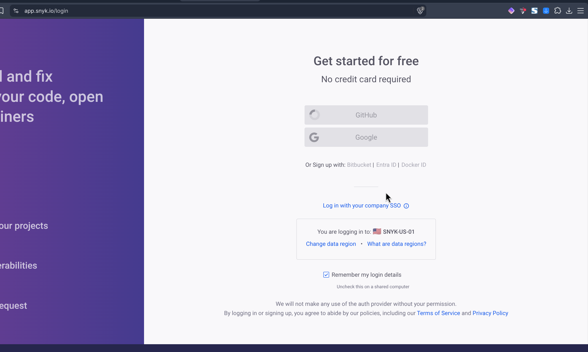
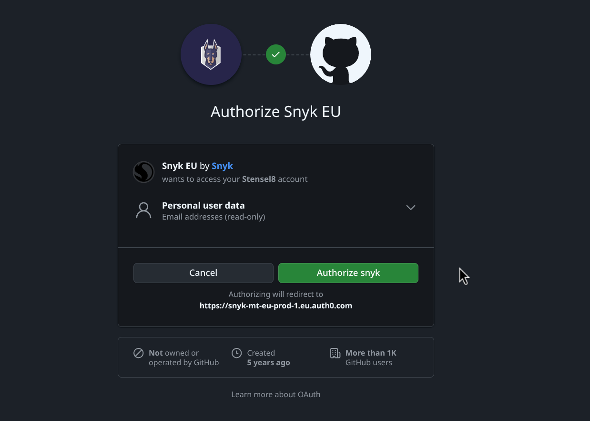
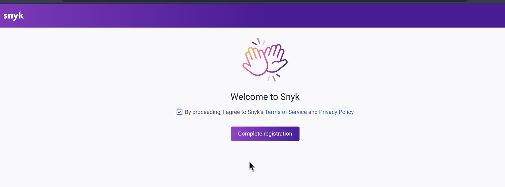

Daarna kies ik GitHub als integratie, importeer ik de repository `DevOps-Security` en zet ik Snyk Code aan. Dat staat standaard uit, en je moet een project na het aanzetten opnieuw importeren om het te scannen.

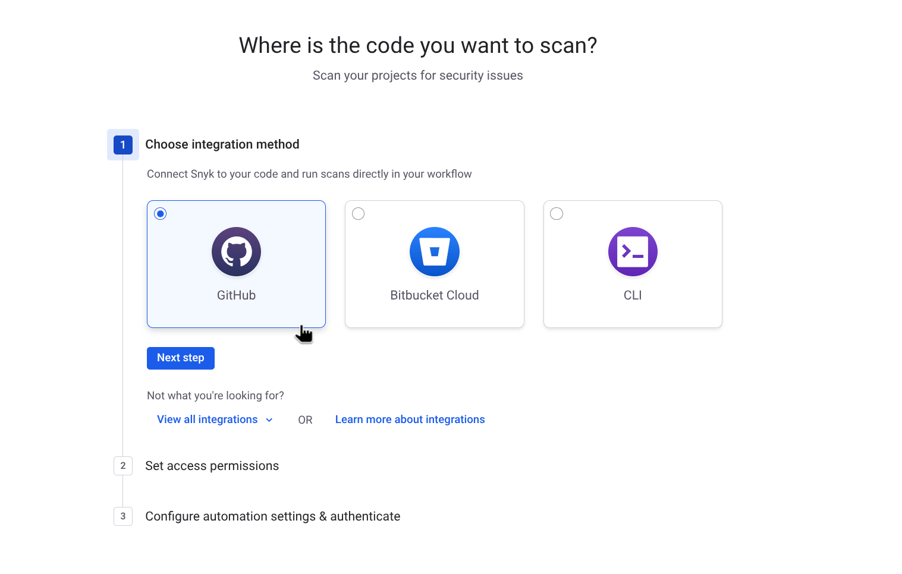
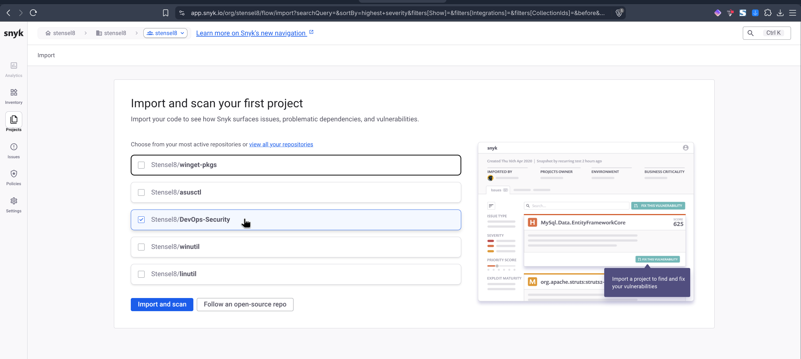
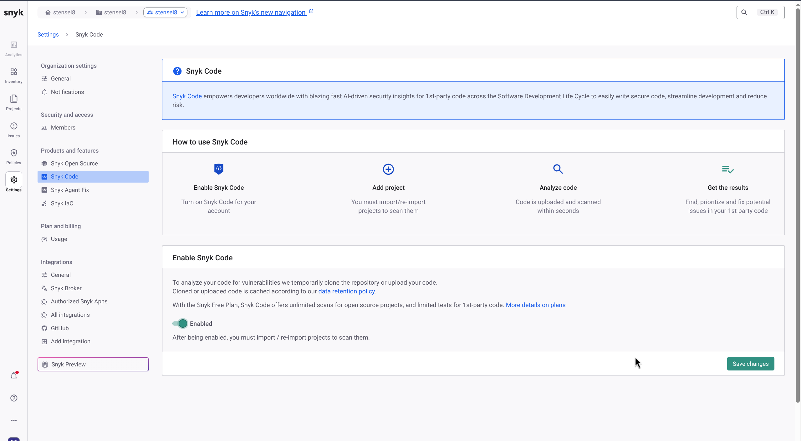

Na een tijdje zie je Snyk alles flaggen. Snyk Code vindt 7 problemen in `content/app.py`: 4 keer SQL-injectie ([CWE-89](https://cwe.mitre.org/data/definitions/89.html)) en 1 keer cross-site scripting ([CWE-79](https://cwe.mitre.org/data/definitions/79.html)), allemaal High, en 2 keer Low voor de cookie zonder `HttpOnly` en zonder `Secure`. Snyk IaC vindt 8 punten in `kubernetes/deployment.yaml` (3 Medium, 5 Low), zoals een container zonder root-user control en zonder memory limit. Snyk Open Source vindt niets.

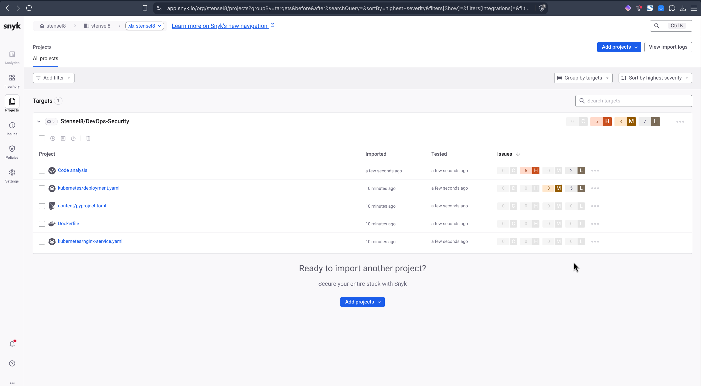
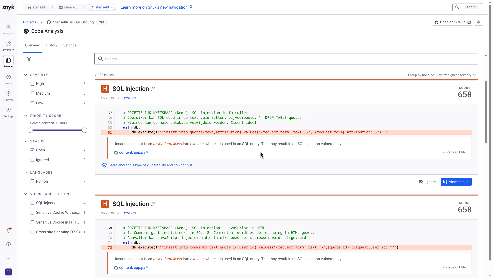

Ik heb ook de Snyk-extensie in VS Code geïnstalleerd, zodat ik live kan scannen. De extensie ziet dezelfde kwetsbaarheden terug, met regelnummer en uitleg.

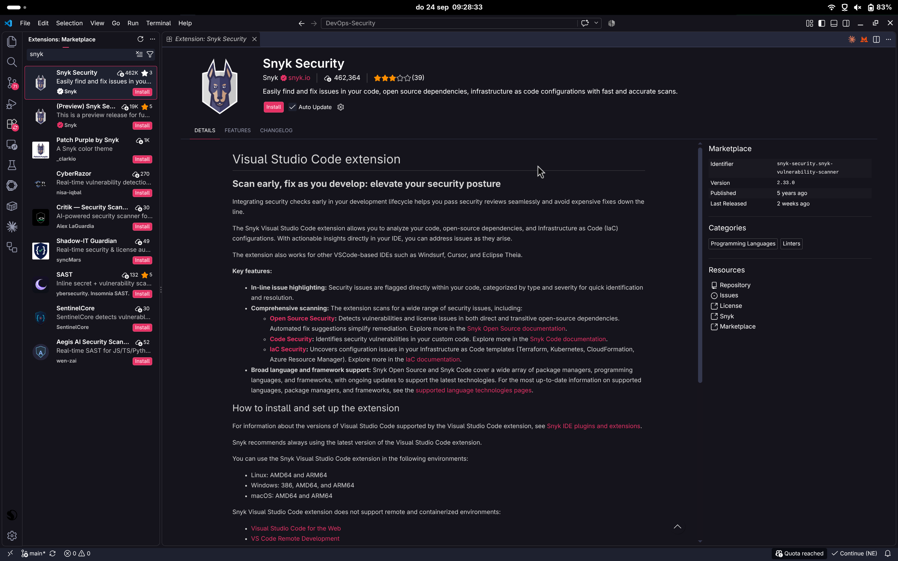
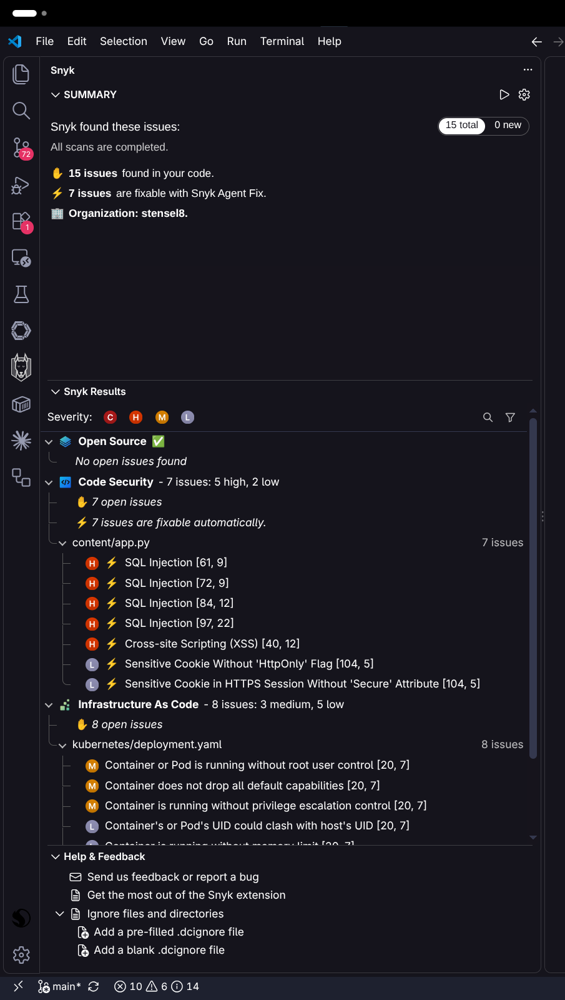

## Extra: GitHub Advanced Security met CodeQL

Als extra heb ik GitHub Advanced Security met CodeQL ingericht. Dat staat in de repository onder Settings, Advanced Security. Zie de screenshots voor de instellingen.


GitHub toont daarna een getal (10) bij het tabblad Security and quality, en onder Code scanning staan de kwetsbaarheden die de ingebouwde tooling al gevonden heeft.

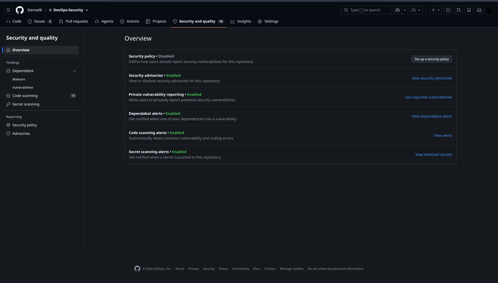


Als ik op een kwetsbaarheid klik, zie ik precies wat er mis is en waar het staat. GitHub geeft ook een link naar de CWE in de MITRE-database, hier [CWE-89](https://cwe.mitre.org/data/definitions/89.html) (SQL-injectie).

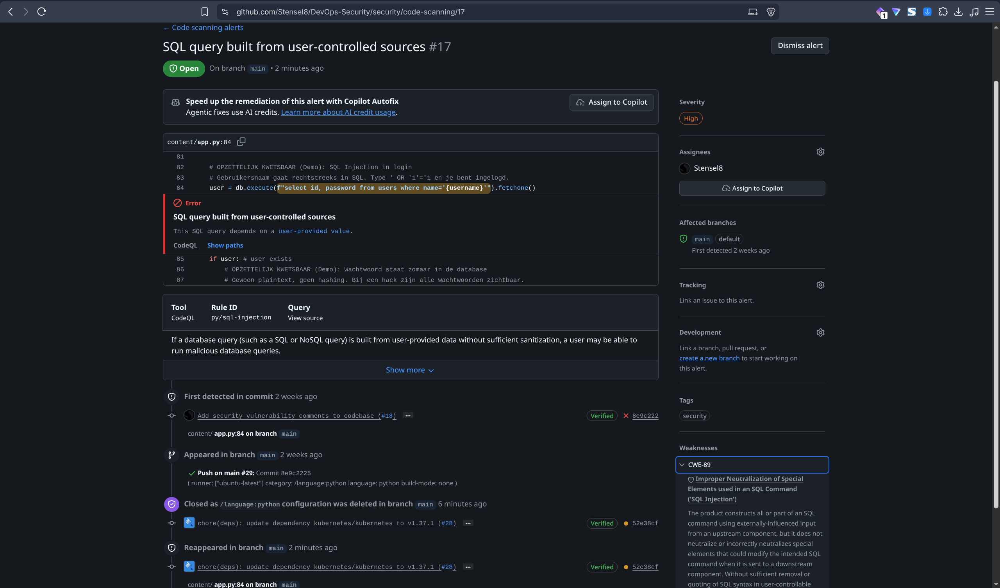


## 2.2 Kwetsbaarheden oplossen

Voor de fixes staan er 10 open meldingen in GitHub Code scanning (CodeQL): 6 keer SQL-injectie, 1 keer XSS, 1 keer URL-redirect en 2 keer cookie.

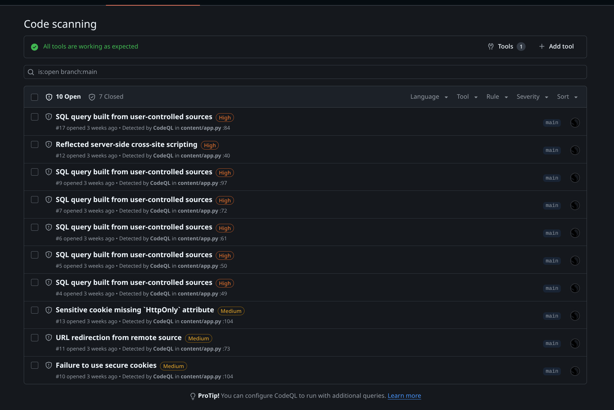

Ik heb ze in vijf stappen opgelost. Fix 1, 2, 4 en 5 staan elk in een eigen commit, zodat je de diff los kunt bekijken.

### Fix 1: SQL-injectie

De queries plakten invoer van gebruikers met een f-string in de SQL. Een aanvaller kan daardoor zelf SQL meesturen. Met `nope' UNION SELECT 1,'hax` als gebruikersnaam was ik ingelogd als gebruiker 1 zonder wachtwoord, en via het quote-formulier kwamen de wachtwoorden uit de database in een quote terecht.

Ik heb dit opgelost met geparametriseerde queries: de SQL-tekst staat vast en de waarden gaan apart mee als parameter (`?`), dus de database ziet ze nooit als SQL. Snyk vond 4 plekken en CodeQL 6. Ik heb alle 6 queries aangepast, ook de twee in `get_comments_page`: `quote_id` is daar al een integer, maar een f-string in een query blijft een onveilig patroon.

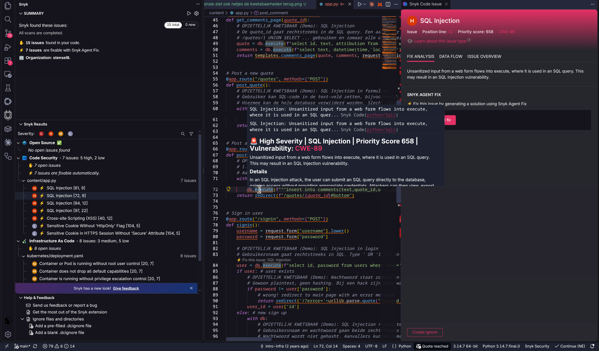

Zie de diff van commit [`4965429`](https://github.com/Stensel8/DevOps-Security/commit/4965429):

```diff
--- a/content/app.py
+++ b/content/app.py
@@ -44,9 +44,6 @@ def index():
 @app.route("/quotes/<int:quote_id>")
 def get_comments_page(quote_id):
-    # OPZETTELIJK KWETSBAAR (Demo): SQL Injection
-    # De quote_id gaat rechtstreeks in de SQL query. Een aanvaller kan iets als
-    # /quotes/1 UNION SELECT ... gebruiken en zomaar alle data stelen.
-    quote = db.execute(f"select id, text, attribution from quotes where id={quote_id}").fetchone()
-    comments = db.execute(f"select text, datetime(time,'localtime') as time, name as user_name from comments c left join users u on u.id=c.user_id where quote_id={quote_id} order by c.id").fetchall()
+    quote = db.execute("select id, text, attribution from quotes where id=?", (quote_id,)).fetchone()
+    comments = db.execute("select text, datetime(time,'localtime') as time, name as user_name from comments c left join users u on u.id=c.user_id where quote_id=? order by c.id", (quote_id,)).fetchall()
     return templates.comments_page(quote, comments, request.user_id)
 
@@ -55,9 +52,6 @@ def get_comments_page(quote_id):
 @app.route("/quotes", methods=["POST"])
 def post_quote():
-    # OPZETTELIJK KWETSBAAR (Demo): SQL Injection in formulier
-    # Gebruiker kan SQL-code in de text-veld zetten, bijvoorbeeld: "; DROP TABLE quotes; --
-    # Hiermee kan de hele database verwijderd worden. Slecht idee!
     with db:
-        db.execute(f"""insert into quotes(text,attribution) values("{request.form['text']}","{request.form['attribution']}")""")
+        db.execute("insert into quotes(text,attribution) values(?,?)", (request.form['text'], request.form['attribution']))
     return redirect("/#bottom")
 
@@ -66,9 +60,7 @@ def post_quote():
 @app.route("/quotes/<int:quote_id>/comments", methods=["POST"])
 def post_comment(quote_id):
-    # OPZETTELIJK KWETSBAAR (Demo): SQL Injection + JavaScript in HTML
-    # 1. Comment gaat rechtstreeks in SQL. 2. Commentaar wordt zonder escaping in HTML gezet.
-    # Aanvaller kan JavaScript injecteren die in elke bezoeker's browser wordt uitgevoerd.
+    # OPZETTELIJK KWETSBAAR (Demo): commentaar wordt zonder escaping in HTML gezet (zie quoter_templates.py).
     with db:
-        db.execute(f"""insert into comments(text,quote_id,user_id) values("{request.form['text']}",{quote_id},{request.user_id})""")
+        db.execute("insert into comments(text,quote_id,user_id) values(?,?,?)", (request.form['text'], quote_id, request.user_id))
     return redirect(f"/quotes/{quote_id}#bottom")
 
@@ -80,7 +72,5 @@ def signin():
     password = request.form["password"]
 
-    # OPZETTELIJK KWETSBAAR (Demo): SQL Injection in login
-    # Gebruikersnaam gaat rechtstreeks in SQL. Type ' OR '1'='1 en je bent ingelogd.
-    user = db.execute(f"select id, password from users where name='{username}'").fetchone()
+    user = db.execute("select id, password from users where name=?", (username,)).fetchone()
     if user: # user exists
         # OPZETTELIJK KWETSBAAR (Demo): Wachtwoord staat zomaar in de database
@@ -92,8 +82,6 @@ def signin():
     else: # new sign up
         with db:
-            # OPZETTELIJK KWETSBAAR (Demo): SQL Injection + plaintext wachtwoord
-            # Gebruikersnaam en wachtwoord gaan beide rechtstreeks in SQL.
-            # Wachtwoord wordt niet gehasht. Aanvallers kunnen zomaar accounts hack.
-            cursor = db.execute(f"insert into users(name,password) values('{username}', '{password}')")
+            # OPZETTELIJK KWETSBAAR (Demo): wachtwoord wordt niet gehasht.
+            cursor = db.execute("insert into users(name,password) values(?,?)", (username, password))
             user_id = cursor.lastrowid
 
```

Getest op het gebouwde image: de gebruikersnaam-aanval maakt nu een gewoon nieuw account met een rare naam in plaats van in te loggen als gebruiker 1, en een quote met `"; DROP TABLE quotes; --` staat letterlijk op de pagina met de tabel intact.

### Fix 2: XSS (cross-site scripting)

De app zette invoer van gebruikers zonder escaping in de HTML. Daardoor kan iemand JavaScript in een quote, commentaar of gebruikersnaam zetten dat bij elke bezoeker wordt uitgevoerd, bijvoorbeeld ``.

Snyk vindt alleen de variant via de `error`-parameter en stelt voor alleen die parameter in `app.py` te escapen (zie de screenshot). Ik escape liever op één plek, in de template, met `markupsafe.escape` (staat al in de dependencies). Zo zijn ook opgeslagen quotes, commentaren, gebruikersnamen en de paginatitel veilig.

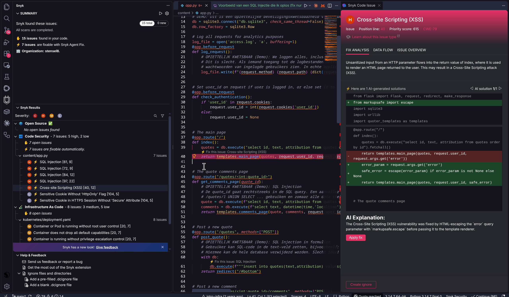

Zie de diff van commit [`251f107`](https://github.com/Stensel8/DevOps-Security/commit/251f107):

```diff
--- a/content/app.py
+++ b/content/app.py
@@ -60,5 +60,4 @@ def post_quote():
 @app.route("/quotes/<int:quote_id>/comments", methods=["POST"])
 def post_comment(quote_id):
-    # OPZETTELIJK KWETSBAAR (Demo): commentaar wordt zonder escaping in HTML gezet (zie quoter_templates.py).
     with db:
         db.execute("insert into comments(text,quote_id,user_id) values(?,?,?)", (request.form['text'], quote_id, request.user_id))
--- a/content/quoter_templates.py
+++ b/content/quoter_templates.py
@@ -1,7 +1,10 @@
+from markupsafe import escape
+
+
 def quote_fragment(id, text, attribution):
     return f"""
 <a href="/quotes/{id}" class="quote img{id % 13}">
-  <q>{text}</q>
-  <address>{attribution}</address>
+  <q>{escape(text)}</q>
+  <address>{escape(attribution)}</address>
 </a>
 """
@@ -10,15 +13,12 @@ def quote_fragment(id, text, attribution):
 
 def comment_fragment(text,user_name,time):
-  # OPZETTELIJK KWETSBAAR (Demo): JavaScript injecteren in comments
-  # Gebruiker kan JavaScript schrijven in comment. Bijvoorbeeld: 
-  # Dit voert JavaScript uit in iedereen's browser die het comment ziet.
   time_html = f"<time>{time}</time>" if time else ""
   return f"""
 <section class="comment">
   <aside>
-    <address>{user_name}</address>
+    <address>{escape(user_name)}</address>
 {time_html}
   </aside>
-  <p>{text}</p>
+  <p>{escape(text)}</p>
 </section>
 """
@@ -70,5 +70,5 @@ def page(content,user_id,title,error=None):
 <html lang="en-US">
 <head>
-  <title>{title or "Quoter XP"}</title>
+  <title>{escape(title or "Quoter XP")}</title>
   <meta charset="utf-8">
   <link rel="stylesheet" type="text/css" href="/static/style.css">
@@ -101,5 +101,5 @@ def page(content,user_id,title,error=None):
   <form action="/signin" method="post">
     <p class="warn">WARNING!!: This site is intentionally insecure. Do not use passwords you may be using on other services.</p>
-    {f"<div class=error>{error}</div>" if error else ""}
+    {f"<div class=error>{escape(error)}</div>" if error else ""}
     <h3>Username</h3>
     <input type="text" name="username">
```

Getest op het gebouwde image: `` staat nu als gewone tekst op de pagina, ook via `?error=`, een quote, een attributie en een gebruikersnaam.

### Fix 3: dependencies bijwerken en SHA-pinning

Als derde fix heb ik alle dependencies geüpgraded en gebumpt, met behulp van Renovate en Dependabot. Snyk Open Source vindt daardoor niets.

Voor dependencies pin ik zoveel mogelijk vast op een versie of commit-SHA. Dat is een vorm van supply-chain-beveiliging: een tag als `v4` kan later naar andere code wijzen, bijvoorbeeld als een actie of image wordt aangepast of gekaapt, een SHA niet. Zo draait er alleen code die ik heb gezien, en Renovate en Dependabot maken een pull request voor elke nieuwe versie, zodat ik bewust update. Concreet staat de base image op een digest, staan alle GitHub Actions op een volledige commit-SHA (met de versie als commentaar), bevat `poetry.lock` hashes van de packages en staat de K3s-versie vast in het script.

```dockerfile
FROM python:3.14-slim-bookworm@sha256:82bc3c539b8813ada9d68c63b40158fa002f7f33de9bf3312a3dfdc0620dff56
```

```yaml
uses: actions/checkout@3d3c42e5aac5ba805825da76410c181273ba90b1 # v7
```

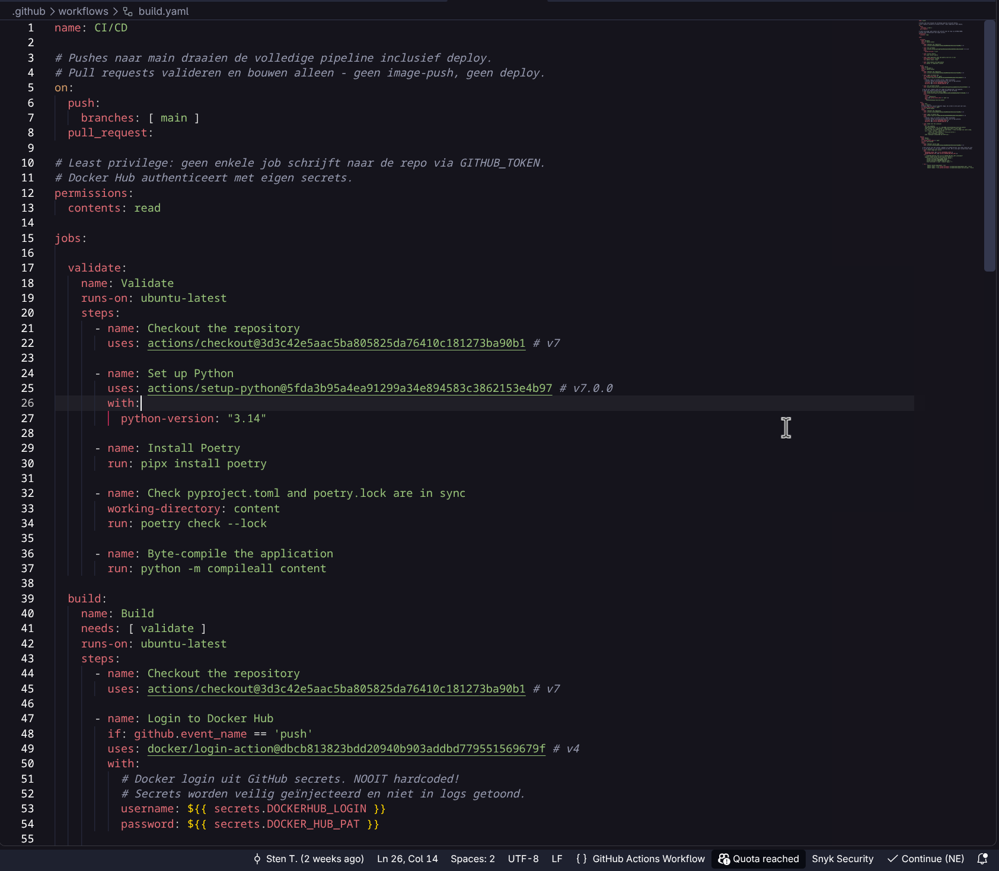

Nog niet vastgepind zijn `stensel8/devops-security:latest` in de Deployment en `pipx install poetry` (zonder versie).

### Fix 4: cookie met HttpOnly en SameSite

De `user_id`-cookie had geen `HttpOnly`, dus JavaScript op de pagina kon hem lezen, bijvoorbeeld via een XSS. Met `httponly=True` kan alleen de browser hem nog versturen, en `samesite='Lax'` zorgt dat hij niet meegaat bij verzoeken vanaf andere sites. CodeQL en Snyk melden dit allebei. Zie de diff van commit [`3dfae64`](https://github.com/Stensel8/DevOps-Security/commit/3dfae64):

```diff
--- a/content/app.py
+++ b/content/app.py
@@ -90,3 +90,3 @@ def signin():
     response = make_response(redirect('/'))
-    response.set_cookie('user_id', str(user_id))
+    response.set_cookie('user_id', str(user_id), httponly=True, samesite='Lax')
     return response
```

### Fix 5: redirect met url_for

CodeQL meldt een URL-redirect omdat `quote_id` uit de URL komt en in de redirect terechtkomt. Door `<int:quote_id>` was dit in de praktijk lastig te misbruiken, maar `url_for` is het veiligere patroon: de URL wordt uit de route van de app zelf gebouwd in plaats van uit tekst die ik aan elkaar plak. Zie de diff van commit [`2a2e85f`](https://github.com/Stensel8/DevOps-Security/commit/2a2e85f):

```diff
--- a/content/app.py
+++ b/content/app.py
@@ -1,2 +1,2 @@
-from flask import Flask, request, redirect, make_response
+from flask import Flask, request, redirect, make_response, url_for
 import sqlite3
@@ -63,3 +63,3 @@ def post_comment(quote_id):
         db.execute("insert into comments(text,quote_id,user_id) values(?,?,?)", (request.form['text'], quote_id, request.user_id))
-    return redirect(f"/quotes/{quote_id}#bottom")
+    return redirect(url_for("get_comments_page", quote_id=quote_id, _anchor="bottom"))
 
```

Vooraf heb ik de CodeQL CLI lokaal gedraaid: op de originele code kreeg ik dezelfde 10 meldingen als op GitHub, na de fixes nog 1.

### Bewust nog open

De `Secure`-vlag op de cookie (CodeQL en Snyk) heb ik niet gezet. Die werkt alleen over HTTPS, en de app draait bewust op gewone HTTP: een browser slaat een `Secure`-cookie niet op via HTTP, dus dan kan ik niet meer inloggen. In GitHub heb ik deze melding gesloten als "won't fix", met die reden erbij.

Ook de andere bewuste kwetsbaarheden blijven staan: de `user_id` in de cookie is niet ondertekend, wachtwoorden staan in platte tekst en in het logbestand. De 8 punten van Snyk IaC in `deployment.yaml` zijn ook nog niet opgelost.

## 2.3 Advies: veilig ontwikkelen in Plan en Code

SolidApps schrijft in JavaScript en C# met Visual Studio. Mijn advies voor de fasen Plan en Code:

**Threat modeling.** Doe bij elke nieuwe feature een korte sessie met STRIDE op een data flow diagram, en prioriteer de bedreigingen met DREAD of de OWASP-methode. Bij onze app wijzen "inloggen" en "quote plaatsen" al meteen op invoer van buiten (tampering, SQL-injectie) en opgeslagen gebruikersgegevens (information disclosure).

**Codestandaarden.** Gebruik de OWASP Top 10 als basis, OWASP ASVS als checklist en de OWASP Cheat Sheets per kwetsbaarheid, bijvoorbeeld parameterized queries tegen SQL-injectie en output encoding tegen XSS: precies mijn twee fixes. Leg vast dat je nooit strings in queries plakt, altijd uitvoer escapet en geen secrets in code zet.

**Tools voor developers.** Een Snyk-extensie (die bestaat ook voor Visual Studio) toont fouten terwijl je typt. Secret scanning met push protection staat in mijn repository aan. Peer review gaat via pull requests met verplichte goedkeuring, en Snyk en CodeQL zet je als check op elke pull request, zodat een kwetsbaarheid niet ongemerkt in `main` komt. Dependabot en Renovate houden de dependencies bij.

**SAST en DAST.** SAST (static application security testing) analyseert de broncode zonder de app te draaien en vindt bijvoorbeeld een f-string in `db.execute`. Het werkt vroeg, in de IDE en op elke pull request, maar geeft ook valse positieven. Snyk Code en CodeQL zijn SAST. DAST (dynamic application security testing) test de draaiende applicatie van buiten, zoals een aanvaller, bijvoorbeeld met OWASP ZAP. Het vindt problemen in configuratie en runtime die je in de code niet ziet, maar werkt pas laat en zegt niet welke regel fout is. SolidApps past SAST toe in Plan en Code (IDE en pull request) en DAST in de testfase van de pipeline, tegen de omgeving die net is uitgerold.

Bronnen: [DevSecOps-controls (Microsoft)](https://learn.microsoft.com/nl-nl/azure/cloud-adoption-framework/secure/devsecops-controls), [SAST (Snyk)](https://snyk.io/learn/application-security/static-application-security-testing/), [Threat modeling (OWASP)](https://owasp.org/www-community/Threat_Modeling), [Bedreigingen per STRIDE-categorie (Microsoft)](https://learn.microsoft.com/en-us/azure/security/develop/threat-modeling-tool-threats), [OWASP Top 10](https://owasp.org/www-project-top-ten/), [OWASP ASVS](https://owasp.org/www-project-asvs/), [SQL Injection Prevention Cheat Sheet](https://cheatsheetseries.owasp.org/cheatsheets/SQL_Injection_Prevention_Cheat_Sheet.html), [XSS Prevention Cheat Sheet](https://cheatsheetseries.owasp.org/cheatsheets/Cross_Site_Scripting_Prevention_Cheat_Sheet.html), [Source Code Analysis Tools (OWASP)](https://owasp.org/www-community/Source_Code_Analysis_Tools), [OWASP ZAP](https://www.zaproxy.org/), [Voorbeeld SQL-injectie](https://github.com/doublehops/sql-injection-attack-example).

Voor SHA-pinning: [Security hardening for GitHub Actions](https://docs.github.com/en/actions/how-tos/security-for-github-actions/security-guides/security-hardening-for-github-actions), [Docker best practices: pin base image versions](https://docs.docker.com/build/building/best-practices/) en [Renovate: Docker digest pinning](https://docs.renovatebot.com/docker/).
