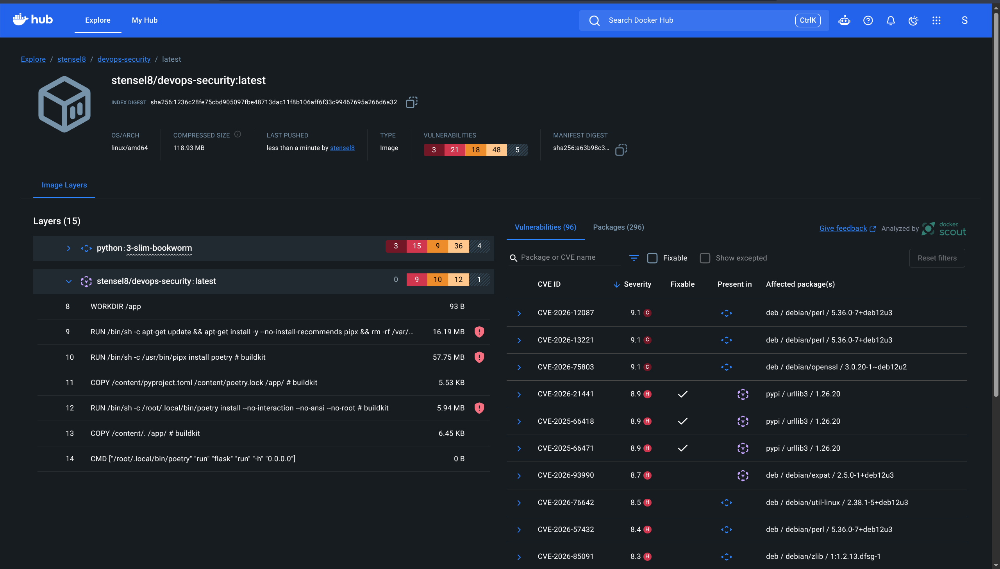

# Week 3

## 3.2 Docker Scout

Als ik het image in de beginstaat bouw, is hij al erg kwetsbaar. Docker Scout flagt meteen alles: 96 kwetsbaarheden, waarvan 3 Critical en 21 High. Het meeste komt uit de basisimage (`python:3-slim-bookworm`), maar ook in onze eigen lagen zitten 9 High. Zie de screenshots.

Een Trivy-scan telt anders (98 High/Critical-bevindingen), omdat scanners andere databases en tellingen gebruiken. Daarin zitten 96 bevindingen in de Debian-basislaag zonder fix en 2 in Python-pakketten van Poetry, mét fix.
