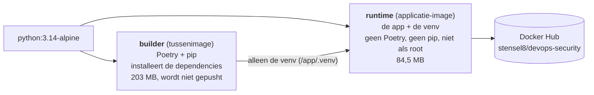
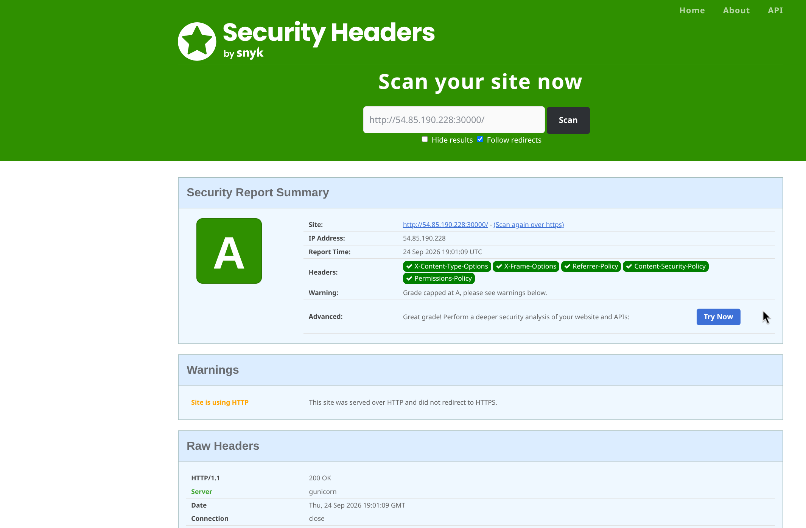
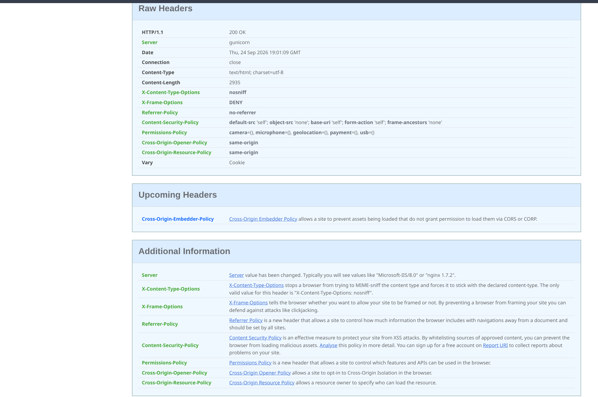

# Week 3

## 3.1 SBOM

Een SBOM (Software Bill of Materials) is een lijst van alle onderdelen in een image. Per onderdeel staat erin wat het is, welke versie, welk type (bijvoorbeeld `apk` of `pypi`), de licentie en een vaste naam (`purl`). Dat staat in een standaardformaat zoals CycloneDX of SPDX, zodat een scanner het kan lezen. Een scanner vergelijkt die lijst met databases van bekende kwetsbaarheden. Komt er een nieuwe CVE bij, dan zie je met de SBOM meteen welke images het package bevatten.

Ik heb met Trivy een SBOM in CycloneDX gemaakt van het image zoals het was (commit `790a9b8^`, Debian met Poetry) en van het huidige image:

```
$ trivy image --format cyclonedx --output sbom.cdx.json <image>

# oud (Debian, Poetry in het image)
library-componenten: 272  (deb: 126, pypi: 146)
# nu (Alpine, alleen de runtime)
library-componenten: 38   (apk: 30, pypi: 8)
```

Door de andere basisimage en de multi-stage build (zie 3.2) zitten er nog 38 onderdelen in plaats van 272. Van Python zijn het alleen nog de 8 packages die de app nodig heeft: Flask, Werkzeug, Jinja2, MarkupSafe, itsdangerous, click, blinker en gunicorn. De hele SBOM staat in [sbom/devops-security.cdx.json](sbom/devops-security.cdx.json). Zo ziet één onderdeel eruit:

```json
{
  "name": "Flask",
  "version": "3.1.3",
  "purl": "pkg:pypi/flask@3.1.3",
  "licenses": [{ "license": { "id": "BSD-3-Clause" } }]
}
```

In de pipeline staat nu ook `sbom: true` bij de build-stap. Dan maakt Docker bij elke build een SBOM en zet die als attestation bij het image op Docker Hub.

## 3.2 Docker Scout

Het image in de beginstaat is kwetsbaar. Docker Scout laat 96 kwetsbaarheden zien, waarvan 3 Critical en 21 High. Het meeste zit in de basisimage (`python:3-slim-bookworm`: 3 Critical, 15 High). Mijn eigen lagen hebben ook 9 High, door `apt-get install pipx`.


### Alle kwetsbaarheden fixen

Ik heb de Dockerfile aangepast (commit [`790a9b8`](https://github.com/Stensel8/DevOps-Security/commit/790a9b8)):

- `python:3.14-alpine` als basis in plaats van Debian.
- Het image draait als gebruiker 10001, niet als root.
- Twee stappen (multi-stage): een **builder** waarin Poetry de dependencies installeert en een **runtime** met alleen de app en de venv. Alleen de runtime gaat naar Docker Hub (`target: runtime`). Poetry en pip zitten dus niet in het image dat draait.



De twee `FROM`-regels in de [Dockerfile](../Dockerfile) zijn bewust: elke `FROM` begint een nieuw, schoon image. `COPY --from=builder` haalt alleen `/app/.venv` uit de builder. Pip haal ik uit de runtime, want de app heeft het niet nodig en scanners melden de gebundelde onderdelen (msgpack, setuptools). De builder draait als root, maar die stage komt niet in het image dat draait.

```dockerfile
FROM python:3.14-alpine@sha256:9e9f... AS builder
COPY app/pyproject.toml app/poetry.lock ./
RUN poetry install --no-root --only main --no-interaction --no-ansi

FROM python:3.14-alpine@sha256:9e9f... AS runtime
RUN PIP_ROOT_USER_ACTION=ignore pip uninstall -y pip
COPY --chown=10001:10001 app/ /app/
COPY --from=builder --chown=10001:10001 /app/.venv /app/.venv
USER 10001:10001
```

Ik heb Alpine gekozen. Trivy telt op de Debian-basisimage 252 kwetsbaarheden en op Alpine 3 (die komen uit pip en verdwijnen in de runtime). Trivy telt anders dan Docker Scout, want scanners gebruiken andere databases.

```
$ trivy image --scanners vuln python:3.14-slim-bookworm
Total: 252 (UNKNOWN: 2, LOW: 86, MEDIUM: 104, HIGH: 55, CRITICAL: 5)

$ trivy image --scanners vuln python:3.14-alpine
Total: 3 (UNKNOWN: 0, LOW: 0, MEDIUM: 1, HIGH: 2, CRITICAL: 0)      # uit pip
```

Trivy op mijn twee stages, lokaal gebouwd met `docker build --target builder` en `--target runtime` (getagd als `proof-builder` en `proof-runtime`):

```
$ docker images --format '{{.Repository}} {{.Size}}' | grep proof
proof-runtime 84.5MB
proof-builder 203MB

$ trivy image --severity HIGH,CRITICAL --scanners vuln proof-builder
Python (python-pkg)
Total: 2 (HIGH: 2, CRITICAL: 0)
│ msgpack    │ GHSA-6v7p-g79w-8964 │ HIGH │ fixed │ 1.1.2  │ 1.2.1  │
│ setuptools │ CVE-2025-47273      │ HIGH │ fixed │ 70.3.0 │ 78.1.1 │

$ trivy image --severity HIGH,CRITICAL --scanners vuln proof-runtime
proof-runtime (alpine 3.24.2)   alpine       0
blinker, click, flask, gunicorn, itsdangerous, jinja2, markupsafe, werkzeug   python-pkg   0
```

Docker Scout laat na de fix 0 kwetsbaarheden zien (het waren er 3 Critical, 21 High, 18 Medium en 48 Low) en 47 packages (het waren er 127).


Het image is ook kleiner. Gecomprimeerd ging het van 118,93 MB naar 17 MB (zoals Docker Hub het toont), uitgepakt van ongeveer 437 MB naar 84,5 MB (lokaal gemeten, met gunicorn erbij).

### Extra in de app

Buiten de opdracht heb ik nog drie kleine dingen aangepast. De app draait onder gunicorn in plaats van `flask run`, want dat is de ontwikkelserver ([`830426d`](https://github.com/Stensel8/DevOps-Security/commit/830426d)). Vanwege het read-only bestandssysteem staat er `--worker-tmp-dir /dev/shm` en `--no-control-socket` bij. De pagina's staan in Jinja-templates die vanzelf escapen ([`071ad02`](https://github.com/Stensel8/DevOps-Security/commit/071ad02)). Elk antwoord krijgt `X-Content-Type-Options`, `X-Frame-Options` en `Referrer-Policy` ([`8e01026`](https://github.com/Stensel8/DevOps-Security/commit/8e01026)). Daarna heb ik de app gescand met [securityheaders.com](https://securityheaders.com), de headerscanner van Snyk. Toen stonden de drie headers van hierboven er al in, en dat gaf een D, want `Content-Security-Policy` en `Permissions-Policy` ontbraken. Die heb ik toegevoegd, samen met `Cross-Origin-Opener-Policy` en `Cross-Origin-Resource-Policy` ([`e3fca00`](https://github.com/Stensel8/DevOps-Security/commit/e3fca00)). De CSP staat alleen scripts, CSS en plaatjes van de app zelf toe. Daarna gaf de scan een A. Hoger kan niet zolang de app op HTTP draait. Dat komt in week 5 met de Ingress en een certificaat.





De achtergrondfoto's kwamen van `cdn.glitch.com`, maar dat domein bestaat niet meer. Ik heb ze teruggezocht op Unsplash en host ze nu zelf in `static/img/` ([`28dcc30`](https://github.com/Stensel8/DevOps-Security/commit/28dcc30)), dus de CSP hoeft geen ander domein toe te staan.

De screenshot van Docker Scout hierboven is van vóór gunicorn. Trivy geeft op het huidige image 0 kwetsbaarheden.
