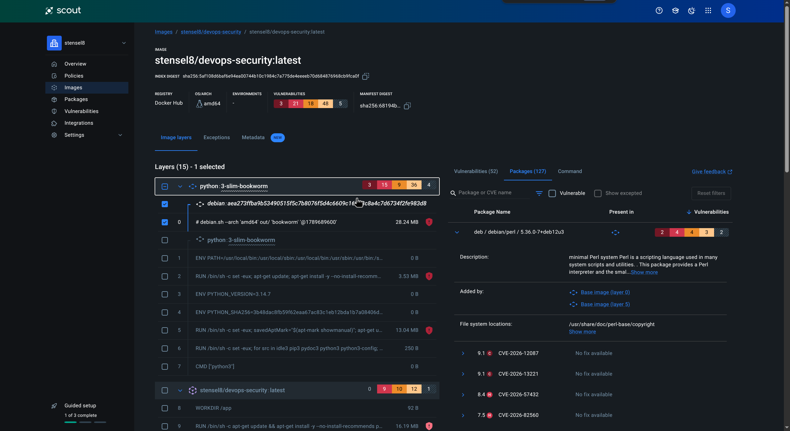
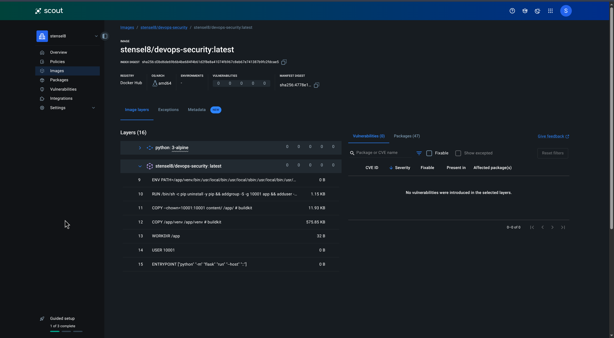

# Week 3

## 3.2 Docker Scout

Als ik het image in de beginstaat bouw, is het al best kwetsbaar. Docker Scout laat meteen alles zien: 96 kwetsbaarheden, waarvan 3 Critical en 21 High. Het meeste zit in de basisimage (`python:3-slim-bookworm`), maar in onze eigen lagen zitten ook 9 High. Zie de screenshots.


Trivy telt anders, die komt op 98 High of Critical. Scanners gebruiken andere databases en tellen anders. Van die 98 zitten er 96 in de Debian-basislaag, waarvoor nog geen fix bestaat, en 2 in Python-packages van Poetry, waarvoor wel een fix is.

### Alle kwetsbaarheden fixen

Daarna heb ik geprobeerd om alle kwetsbaarheden uit het image te halen. Docker Scout liet zien dat de basisimage `python:3-slim-bookworm` (Debian) zelf al 3 Critical en 15 High had, waarvoor vaak geen fix beschikbaar is, en dat onze eigen laag met `apt-get install pipx` er nog 9 High bij deed.



Ik heb de Dockerfile daarom aangepast (commit [`790a9b8`](https://github.com/Stensel8/DevOps-Security/commit/790a9b8)). Ik gebruik nu `python:3.14-alpine` als basis in plaats van Debian en het image draait niet meer als root, maar als gebruiker 10001. Ook bouw ik nu in twee stappen (multi-stage), dus er zijn twee images.

Het eerste is de **builder**, een tussenimage waarmee ik bouw. Daarin installeert Poetry de dependencies uit `poetry.lock`. Dat image wordt niet gepusht. Het tweede is de **runtime**, het uiteindelijke applicatie-image dat naar Docker Hub gaat. Dat begint opnieuw vanaf de schone basisimage en krijgt alleen de app en de venv met de dependencies uit de builder. Daardoor zit er geen Poetry en geen pip in het image dat draait. Pip heb ik ook uit de runtime gehaald, want die had oude gebundelde onderdelen (msgpack en setuptools) waar de scanner over klaagde, en de app heeft pip niet nodig om te draaien.


Er staan twee `FROM`-regels in, en dat is bewust. Elke `FROM` begint een nieuw, schoon image, dus de tweede begint opnieuw en heeft niets van de builder. Met `COPY <van> <naar>` zet ik dingen in het image dat ik aan het bouwen ben. Zonder `--from` komt de bron uit mijn eigen repo: in de builder kopieer ik alleen `pyproject.toml` en `poetry.lock` (de lijst met dependencies), in de runtime de app zelf (`content/`). Met `--from=builder` komt de bron uit de builder. Dat is de map `/app/.venv` die Poetry daar heeft gemaakt, en het is het enige dat ik uit de builder meeneem.

Het verschil is duidelijk. De builder is 192 MiB, heeft Poetry en pip en nog 3 meldingen in Trivy (uit pip). De runtime is 81 MiB en heeft er 0. In de pipeline staat `target: runtime`, dus alleen dat image wordt gebouwd en gepusht. Het tussenimage kun je zelf bekijken met `docker build --target builder .`.

De builder draait als root. Dat is niet erg, want die stage wordt weggegooid en komt niet in het image dat draait. Wat live draait is de runtime, en die draait als gebruiker 10001. In de runtime is er één stap als root, namelijk pip weghalen. Eerst draaide de builder ook als gewone gebruiker (commit [`e508509`](https://github.com/Stensel8/DevOps-Security/commit/e508509)), maar dat maakte de Dockerfile veel ingewikkelder voor weinig winst. Daarom heb ik hem weer vereenvoudigd (commit [`f1879c5`](https://github.com/Stensel8/DevOps-Security/commit/f1879c5)): Poetry maakt nu zelf de venv en er is geen tweede venv en geen extra gebruiker meer nodig.

Eerst heb ik lokaal met Trivy een paar basisimages vergeleken: Debian bookworm had er 255, Debian trixie 159, Alpine 3 en Chainguard 0. Alpine en Chainguard kwamen allebei op 0 uit, zodra pip eruit was. Ik heb Alpine gekozen, want dat is het bekendste.

```dockerfile
# Dit Dockerfile bouwt in twee stappen (multi-stage), dus er zijn twee images:
#   1. builder  Tussenimage waarmee gebouwd wordt: Poetry installeert hier de dependencies. Wordt niet gepusht.
#   2. runtime  Het applicatie-image dat naar Docker Hub gaat: alleen de app en de dependencies.
#               Geen Poetry, geen pip en het draait niet als root.
#
# COPY <van> <naar>: de bestemming is altijd in het image dat op dat moment gebouwd wordt. Zonder --from
# is de bron jouw repo, met --from=builder is de bron de builder-stage.

# ---------- Stap 1 van 2: builder (tussenimage, wordt niet gepusht) ----------
FROM python:3.14-alpine@sha256:9e9fde4d32eedce0b661d9ab91e826b62dddf28e928c230ec55f1866cac66b01 AS builder

WORKDIR /app
RUN pip install --no-cache-dir poetry==2.5.1

# Uit jouw repo, naar /app in de builder: alleen de lijst met dependencies, niet de code.
# Zolang die twee bestanden gelijk blijven, hergebruikt Docker de installatie uit de cache.
COPY content/pyproject.toml content/poetry.lock ./

# Poetry maakt de venv in /app/.venv (zonder pip) en installeert alleen de dependencies uit poetry.lock
RUN poetry config virtualenvs.in-project true \
    && poetry config virtualenvs.options.no-pip true \
    && poetry install --no-root --only main --no-interaction --no-ansi

# ---------- Stap 2 van 2: runtime (het applicatie-image dat wordt gepusht) ----------
FROM python:3.14-alpine@sha256:9e9fde4d32eedce0b661d9ab91e826b62dddf28e928c230ec55f1866cac66b01 AS runtime

# Pip weghalen: de app heeft het niet nodig en scanners klagen over oude onderdelen erin
RUN PIP_ROOT_USER_ACTION=ignore pip uninstall -y pip

ENV PATH="/app/.venv/bin:$PATH" PYTHONUNBUFFERED=1 PYTHONDONTWRITEBYTECODE=1

# Uit jouw repo, naar /app in dit image: de app zelf (content/). Van gebruiker 10001, want SQLite en het
# logbestand schrijven in de app-map.
COPY --chown=10001:10001 content/ /app/
# Uit de builder (--from=builder), naar dit image: de venv met de dependencies. Het enige dat we uit de
# builder meenemen. Poetry en pip blijven daar.
COPY --from=builder --chown=10001:10001 /app/.venv /app/.venv

WORKDIR /app
USER 10001:10001

# Gunicorn is een echte webserver voor productie. Flask's eigen server (flask run) is alleen voor ontwikkelen.
# Sinds week 3, tijdens commit 830426d.
# --worker-tmp-dir: gunicorn heeft een schrijfbare map voor zijn werkbestanden nodig. Het bestandssysteem is
# read-only, dus we gebruiken /dev/shm (werkgeheugen), dat is altijd schrijfbaar. De control-socket van gunicorn
# (voor beheer op afstand) hebben we niet nodig en zou ook naar het read-only bestandssysteem schrijven.
ENTRYPOINT ["gunicorn", "--bind", "[::]:5000", "--worker-tmp-dir", "/dev/shm", "--no-control-socket", "app:app"]
```

Docker Scout laat nu 0 kwetsbaarheden zien (het waren er 3 Critical, 21 High, 18 Medium en 48 Low) en 47 packages (het waren er 127).



Ook is het image veel kleiner geworden. Gecomprimeerd ging het van 118,93 MB naar 17 MB (zoals Docker Hub het toont) en uitgepakt van ongeveer 437 MB naar 85 MB (lokaal gemeten, met gunicorn erbij).

### Kleine verbeteringen in de app

Naast het image heb ik nog een paar kleine dingen in de app zelf aangepast. Het blijft klein, want in deze module gaat het om het beveiligen.

**Gunicorn in plaats van `flask run`.** De Dockerfile startte de app met `flask run`, maar dat is de ontwikkelserver van Flask en die is niet bedoeld voor productie. Nu draait de app onder gunicorn (commit [`830426d`](https://github.com/Stensel8/DevOps-Security/commit/830426d)). Door het read-only bestandssysteem uit week 2 liep ik daar tegen twee dingen aan. Gunicorn wil een schrijfbare map voor zijn werkbestanden, dus dat is `--worker-tmp-dir /dev/shm` geworden. En hij probeert een control-socket in `/.gunicorn` te maken, dat heb ik uitgezet met `--no-control-socket`. Ik heb het lokaal getest met `docker run --read-only --user 10001:10001 --cap-drop ALL`. De app antwoordt dan via IPv4 en IPv6 en er staan geen fouten in de log.

```diff
@@ Dockerfile:42 @@
-ENTRYPOINT ["python", "-m", "flask", "run", "--host", "::"]
+ENTRYPOINT ["gunicorn", "--bind", "[::]:5000", "--worker-tmp-dir", "/dev/shm", "--no-control-socket", "app:app"]
```

**Templates in plaats van HTML in Python.** De pagina's stonden als f-strings in `quoter_templates.py`. De XSS-fix van week 2 was een `escape()` om elke variabele, dus vergeet je er één, dan is de kwetsbaarheid terug. Nu staan de pagina's als Jinja-templates in `content/templates/` (commit [`071ad02`](https://github.com/Stensel8/DevOps-Security/commit/071ad02)) en escapet Jinja alles wat een gebruiker invult vanzelf. Het inline script staat nu in `static/scroll.js`, dus er zit geen script meer in de HTML. Ik heb de pagina's voor en na de wijziging vergeleken (uitgelogd, ingelogd, met een foutmelding, en een quote met `<script>` en `` erin). De HTML is gelijk, behalve dat het script nu een los bestand is, en de `<script>` uit de invoer komt overal als tekst terug. Een onbekende quote geeft nu een 404 in plaats van een 500.

```diff
@@ content/app.py:53 @@
-    return templates.main_page(quotes, request.user_id, request.args.get('error'))
+    return render_template("index.html", quotes=quotes)
@@ content/app.py:60-61 @@
+    if quote is None:
+        abort(404)
```

**Beveiligingsheaders.** Elk antwoord krijgt nu `X-Content-Type-Options: nosniff`, `X-Frame-Options: DENY` en `Referrer-Policy: no-referrer` (commit [`8e01026`](https://github.com/Stensel8/DevOps-Security/commit/8e01026)). Een `Content-Security-Policy` heb ik niet toegevoegd. Dat kan nu het inline script weg is, maar de CSS haalt de achtergrondplaatjes van `cdn.glitch.com` en daar zou een uitzondering voor nodig zijn. Dat laat ik zo.

Trivy geeft op het nieuwe image nog steeds 0 kwetsbaarheden (Alpine 0, Python-packages 0). De screenshot van Docker Scout hierboven is van vóór gunicorn.
